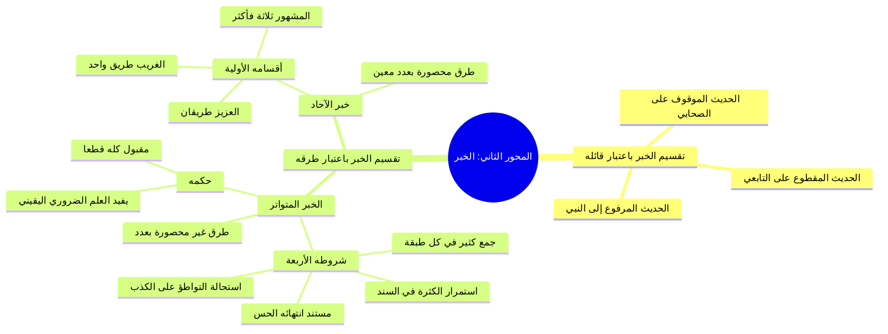

# 00 - الفهرس والخطة: مبحث الخبر والخبر المتواتر

> [!info] بطاقة المحاضرة
> - **المادة:** شرح كتاب [[تيسير مصطلح الحديث]] (أو مبادئ علم مصطلح الحديث).
> - **الشارح:** الشيخ طاحون حفظه الله.
> - **رقم المحاضرة في السلسلة:** المحاضرة 6 (الدرس الثالث في الدورة: بداية المحور الثاني - الخبر).
> - **النطاق المرجعي في التفريغ:** السطور [1 – 96] في [[تفريغ المحاضرة 6]].
> - **الملف المجمّع النهائي:** [[تيسير_مصطلح_الحديث_طاحون_المحاضرة_6_ملف_مجمع]]
> - **إجمالي عدد الأجزاء الدراسية:** 4 أجزاء تفصيلية + 3 ملفات تكميلية + ملف مجمع وجدول مصطلحات.

---

## 📋 خطة الأجزاء التفصيلية

| الجزء | العنوان والرابط | نطاق السطور | المحور والمحتوى الأساسي |
| :---: | :--- | :---: | :--- |
| **01** | [[01 - مدخل المحور الثاني وتقسيمات الخبر]] | 1 – 14 | افتتاح المحور الثاني؛ تقسيم [[الخبر]] باعتبار قائله (مرفوع، موقوف، مقطوع) وباعتبار وصوله (متواتر، آحاد) |
| **02** | [[02 - تعريف الخبر المتواتر لغة واصطلاحاً]] | 15 – 32 | تعريف [[المتواتر]] لغة (التتابع) واصطلاحاً؛ إيراد تعريف النووي وابن الصلاح والتعريف المختار المعتمد |
| **03** | [[03 - شروط الخبر المتواتر وضوابط الطبقات]] | 33 – 78 | شروط التواتر الأربعة؛ مفهوم [[الطبقة]]؛ قاعدة «العبرة بأقل طبقة»؛ استحالة التواطؤ على الكذب؛ استناد الخبر إلى الحس |
| **04** | [[04 - حكم المتواتر وإفادة العلم الضروري وموقعه من علم المصطلح]] | 79 – 96 | إفادة [[العلم الضروري]] اليقيني والفرق بينه وبين [[العلم النظري]]؛ قطعية قبوله؛ سبب استشكال إدراجه في [[علم المصطلح]]؛ الخاتمة |
| **05** | [[05 - ملخص المراجعة السريعة]] | 1 – 96 | بطاقة مراجعة مركزة، جداول مقارنة، القواعد الأصولية والحديثية، خلاصة الشروط والأحكام |
| **06** | [[06 - أسئلة المراجعة والاختبار الذاتي]] | 1 – 96 | بنك أسئلة استيعابية وتطبيقية مع إجابات نموذجية تفصيلية مطوية لاختبار الفهم الذاتي |
| **07** | [[07 - خطة تطبيق الدروس]] | 1 – 96 | خطة عمل تنفيذية مرحلية مزودة بصناديق اختيار للمذاكرة وضبط المسائل وقسم حل المشكلات |
| **—** | [[جدول_تعريفات_المحاضرة_6]] | 1 – 96 | مسرد كامل وجدول مقارن لجميع التعريفات اللغوية والاصطلاحية الواردة بالمجلس |
| **—** | [[تيسير_مصطلح_الحديث_طاحون_المحاضرة_6_ملف_مجمع]] | 1 – 96 | الملف المجمّع النهائي لكامل أجزاء المحاضرة مدمجاً به نص كلام الشارح حرفياً بدون اختصار |

---

## 🗺️ خريطة المفاهيم الهرمية (Mindmap)

---

## 📌 المفاهيم والروابط الأساسية في المحاضرة

- [[الخبر]]: كل ما يُنقل عن النبي ﷺ أو غيره، ويُقسم باعتبار وصوله وباعتبار قائله.
- [[المتواتر]]: ما رواه جمع غفير تحيل العادة تواطؤهم على الكذب وأسندوه إلى محسوس.
- [[الآحاد]]: ما لم تجتمع فيه شروط المتواتر وكانت طرقه محصورة بعدد معين.
- [[الطبقة]]: القوم المتشابهون أو المتقاربون في السن والإسناد (الأخذ عن الشيوخ).
- [[العلم الضروري]]: العلم اليقيني البديهي الذي يضطر الإنسان للتصديق به كالمشاهدات.
- [[العلم النظري]]: العلم الذي يتوقف حصوله على النظر والتأمل وإقامة الاستدلال والبرهان.
- [[السند]]: سلسلة الرجال الموصلة إلى المتن.
- [[علم المصطلح]]: علم بأصول وقواعد يُعرف بها أحوال السند والمتن من حيث القبول والرد.

---

## 👥 أعلام ورد ذكرهم في المحاضرة

- [[النووي]] (الإمام محيي الدين يحيى بن شرف النووي - صاحب المنهاج في شرح صحيح مسلم).
- [[ابن الصلاح]] (الإمام أبو عمرو عثمان بن الصلاح - صاحب علوم الحديث / المقدمة).
- [[الصحابة]] (طبقة الرعيل الأول).
- [[التابعون]] و [[أتباع التابعين]] (طبقات حملة الرواية والأثر).
