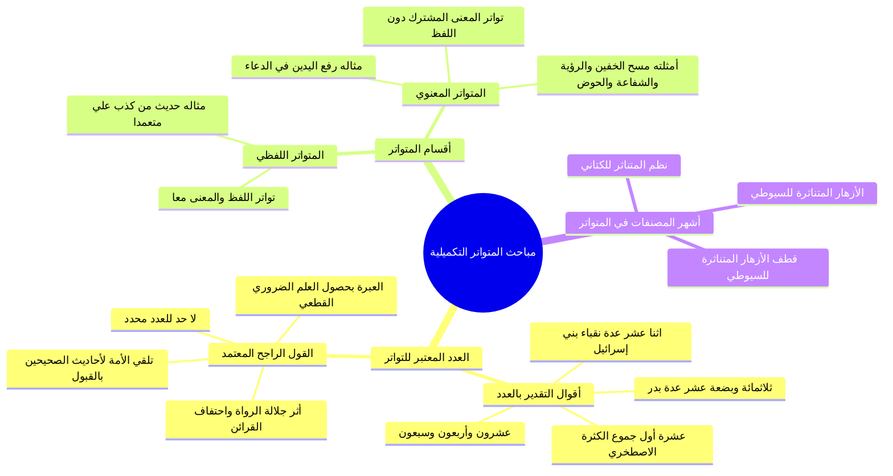

# 00 - الفهرس والخطة: مبحث عدد التواتر وأقسامه وأشهر مصنفاته

> [!info] بطاقة المحاضرة
> - **المادة:** شرح مصطلح الحديث للشيخ باسم طاحون حفظه الله.
> - **رقم المحاضرة في السلسلة:** المحاضرة 7 (الدرس الرابع في المحور الثاني: تمام مبحث الخبر المتواتر).
> - **النطاق المرجعي في التفريغ:** السطور [1 – 72] في [[تفريغ المحاضرة 7]].
> - **الملف المجمّع النهائي:** [[تيسير_مصطلح_الحديث_طاحون_المحاضرة_7_ملف_مجمع]]
> - **إجمالي عدد الأجزاء الدراسية:** 4 أجزاء تفصيلية + 3 ملفات تكميلية + ملف مجمع وجدول مصطلحات.

---

## 📋 خطة الأجزاء التفصيلية

| الجزء | العنوان والرابط | نطاق السطور | المحور والمحتوى الأساسي |
| :---: | :--- | :---: | :--- |
| **01** | [[01 - مراجعة سريعة ومسألة العدد المعتبر في التواتر]] | 1 – 24 | استرجاع تعريف وشروط التواتر؛ قاعدة «العبرة بأقل طبقة»؛ استعراض الأقوال الستة في نصاب عدد التواتر من «تدريب الراوي» للسيوطي |
| **02** | [[02 - تحرير القول الراجح في عدد التواتر وقرائن إفادة العلم]] | 25 – 42 | القول الراجح المعتمد (لا حد لعدد المتواتر والعبرة بحصول العلم القطعي)؛ مذهب ابن تيمية؛ قرائن جلالة الرواة (سلسلة الذهب)؛ وحكم أحاديث الصحيحين |
| **03** | [[03 - أقسام الحديث المتواتر - اللفظي والمعنوي وأمثلتهما]] | 43 – 55 | تقسيم [[المتواتر]] إلى: **لفظي** (حديث من كذب عليّ) و**معنوي** (رفع اليدين في الدعاء، مسح الخفين، الحوض، الرؤية)؛ مع إنشاد البيتين الشهيرين |
| **04** | [[04 - أشهر المصنفات في المتواتر والخاتمة والوصايا]] | 56 – 72 | أشهر كتب المتواتر (الأزهار المتناثرة، قطف الأزهار، نظم المتناثر)؛ الثناء على «تدريب الراوي»؛ التلخيص الشامل والوصايا الختامية |
| **05** | [[05 - ملخص المراجعة السريعة]] | 1 – 72 | بطاقة مراجعة سريعة، جدول الأقوال في العدد، مقارنة اللفظي والمعنوي، والقواعد الكلية |
| **06** | [[06 - أسئلة المراجعة والاختبار الذاتي]] | 1 – 72 | بنك أسئلة منهجية وتطبيقية مع إجابات نموذجية تفصيلية مطوية لاختبار الفهم الذاتي |
| **07** | [[07 - خطة تطبيق الدروس]] | 1 – 72 | خطة تنفيذية مرحلية مزودة بصناديق اختيار للمذاكرة وضبط المسائل وقسم حل المشكلات |
| **—** | [[جدول_تعريفات_المحاضرة_7]] | 1 – 72 | مسرد كامل وجدول مقارن لجميع التعريفات اللغوية والاصطلاحية الواردة بالمجلس |
| **—** | [[تيسير_مصطلح_الحديث_طاحون_المحاضرة_7_ملف_مجمع]] | 1 – 72 | الملف المجمّع النهائي لكامل أجزاء المحاضرة مدمجاً به نص كلام الشارح حرفياً بدون اختصار |

---

## 🗺️ خريطة المفاهيم الهرمية (Mindmap)

---

## 📌 المفاهيم والروابط الأساسية في المحاضرة

- [[المتواتر اللفظي]]: ما تواتر لفظه ومعناه برواية جمع عن جمع من أول السند لآخره.
- [[المتواتر المعنوي]]: ما تواتر معناه في وقائع مختلفة دون تطابق ألفاظه، لاشتراكها في قدر كلي معلوم.
- [[سلسلة الذهب]]: أصح الأسانيد (أحمد عن الشافعي عن مالك عن نافع عن ابن عمر) المفيدة للقطع بجلالة رواتها.
- [[تلقي الأمة بالقبول]]: إجماع علماء الأمة على صحة أحاديث الصحيحين، مما يرفعها لمرتبة القطع واليقين.
- [[العلم الضروري]]: العلم اليقيني الجازم الذي لا يتطرق إليه الشك ولا يحتاج لنظر واستدلال.
- [[تدريب الراوي]]: شرح الإمام السيوطي على تقريب الإمام النووي، وهو من أجمع وأيسر مصنفات المصطلح.

---

## 👥 أعلام ومصنفون ورد ذكرهم في المحاضرة

- [[السيوطي]] (الإمام جلال الدين عبد الرحمن بن أبي بكر السيوطي - صاحب تدريب الراوي والأزهار المتناثرة).
- [[ابن تيمية]] (شيخ الإسلام أحمد بن عبد الحليم بن تيمية - محرر قاعدة عدم حصر عدد المتواتر في مجموع الفتاوى).
- [[الاصطخري]] (الإمام أبو سعيد الحسن بن أحمد الاصطخري الشافعي - القائل بأن أقل التواتر عشرة).
- [[محمد بن جعفر الكتاني]] (محدث المغرب وصاحب نظم المتناثر في الحديث المتواتر).
- [[مازن السرساوي]] (الشيخ المحقق لطبعة تدريب الراوي المعتمدة في الشرح).
