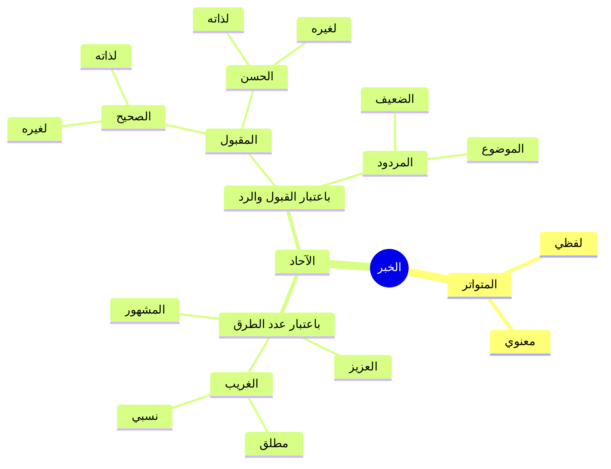

# 01 - مراجعة المحاضرة السابقة وخريطة تقسيم الخبر

> **المحاضرة:** الثالثة — [[تيسير مصطلح الحديث]] | شرح الشيخ الشوبكي
> **المرجع:** الأسطر 1–200

---

## مراجعة سريعة لأهم مفاهيم المحاضرة الماضية

بدأ الشيخ بمراجعة ما سبق دراسته في المحاضرتين الأولى والثانية عبر أسئلة تفاعلية مع الطلاب:

### تعريف [[علم مصطلح الحديث]]

- &rlm;علم أصول وقواعد يُعنى بدراسة **[[السند]]** و**[[المتن]]** من حيث **القبول والرد**.
- **موضوعه:** السند والمتن.
- **ثمرته:** معرفة **[[الحديث الصحيح|الصحيح]]** من **[[الحديث الضعيف|الضعيف]]** من الأحاديث.

### الألفاظ الثلاثة: [[الحديث]] و[[الخبر]] و[[الأثر]]

| المصطلح | التعريف |
|---------|---------|
| &rlm;الحديث | ما أُضيف إلى النبي ﷺ من **قول أو فعل أو تقرير أو صفة** |
| &rlm;الخبر | له ثلاثة معانٍ: ① مرادف للحديث ② ما جاء عن غير النبي ﷺ ③ أعمّ يشمل ما جاء عن النبي ﷺ والصحابة |
| &rlm;الأثر | له معنيان: ① مرادف للحديث ② ما أُسند إلى غير النبي ﷺ |

### [[الإسناد]] و[[السند]]

- &rlm;الإسناد: عزو الحديث إلى قائله مسندًا، أو سلسلة الرجال الموصلة إلى المتن.
- اعتُرض على لفظ "سلسلة" لأن السلسلة قد تكون **منقطعة**، والرجال قد يكونون **نساءً** أو أطفالًا.
- &rlm;السند لغةً: المُعتمَد.

### معاني [[المُسنَد]]

| المعنى | التوضيح |
|--------|---------|
| الحديث **المرفوع المتصل** إسنادًا | حديث اتصل سنده إلى النبي ﷺ |
| كتاب يُروى فيه مرويات كل صحابي على حدة | مثل **[[مسند الإمام أحمد]]** |
| أن يُراد به **السند** نفسه | أي الطريق |

### [[المحدِّث]] و[[الحافظ]] و[[الحاكم]]

| المرتبة | التعريف |
|---------|---------|
| &rlm;المحدِّث | مَن يشتغل بعلم الحديث **رواية ودراية** ويطّلع على كثير من أحوال الرواة |
| &rlm;الحافظ | أرفع درجة من المحدِّث بحيث يكون ما يعرفه في كل طبقة **أكثر** مما لا يعرفه |
| &rlm;الحاكم | الذي **أحاط** علمًا بجميع الأحاديث |

---

## خريطة تقسيم الخبر باعتبار طرق وصوله إلينا

رسم الشيخ خريطة شاملة لتقسيم الخبر على السبورة، وبيّن أن هناك **اعتبارات مختلفة** للتقسيم:

### التفريق بين التقسيمين

- **تقسيم باعتبار الطرق** (مشهور / عزيز / غريب): **لا علاقة له بالصحة والضعف**، فالمشهور منه صحيح وضعيف، والعزيز منه صحيح وضعيف، والغريب كذلك.
- **تقسيم باعتبار القبول والرد** (صحيح / حسن / ضعيف / موضوع): يختص بالبحث في **صحة الحديث من ضعفه**.

> ⚠️ تنبيه
> لا يُحكم على الحديث بأنه صحيح أو ضعيف بمجرد كونه مشهورًا أو عزيزًا أو غريبًا؛ فهذه تقسيمات **باعتبار عدد الطرق** لا باعتبار الصحة.

### الفرق بين [[المتواتر]] و[[الآحاد]] في البحث

| الوجه | المتواتر | الآحاد |
|-------|----------|--------|
| **البحث** | لا يُبحث في سنده أصلًا | يُبحث في صحة سنده ثم في دلالته |
| **الحكم** | يُفيد **[[العلم الضروري]]** (يقين كمشاهدة العين) | يُفيد **[[العلم النظري]]** (يحتاج نظرًا واستدلالًا) |
| **مبحثه** | يُبحث في **دلالته** (معناه) في علم **[[أصول الفقه]]** | يُبحث أولًا في **ثبوته** ثم في **دلالته** |

- أي نص يُبحث فيه في أمرين: **ثبوت سنده** و**دلالته** (معناه).
- [[القرآن الكريم]] ثابت السند فتبقى المسألة في **الدلالة** (ماذا تعني الآية).
- المتواتر كذلك: ثابت فنبحث في **معناه** فقط، وعلم الدلالة يختص به **[[أصول الفقه]]** لا علم الحديث.
- الآحاد فيه **مشكلتان:** ① هل هو صحيح أم ضعيف؟ ② ما معناه ودلالته؟

> كما قال **[[ابن تيمية]]**: إذا جاءك حديث فلك فيه **طريقان**: صحة سنده، وصحة فهمه.

---

📖 نص المتحدث الكامل — مراجعة المحاضرة السابقة وخريطة تقسيم الخبر (أسطر 1–200)

مصطلح مصطلح غائب صاحب غائب صاحبه

ايه غائب صاحبه مش عارف

هستعمل السبوره

اه يا سيدنا

ثواني ثواني ثواني بسح

ثواني

ذاكرتوا اللي احنا اخدناه ولا ما ذاكرتوش

يا راجل ش بتقوى الاله نجا من نجاه وفاز وصار الى ماج مستعدين اسال في المحاضره اللي فاتت اسال في المحاضره اللي فاتت ام الجماعه عاملين نفسهم بيقروا دول ولا اللي بيعملوا ايه دي يا عم حاول تبعدها شويه ولا تنزلها في ناس مش شايفه من طلعنا جنب كده لا في زوجي كده ولا في اي حاجه السلام عليكم ورحمه الله وبركاته

السلام

الحمد لله رب العالمين الحمد لله حمدا لا ينفد افضل ما ينبغي ان يحمد وصلى الله وسلم على افضل المصطفين محمد وعلى اله واصحابه ومن تعبد ثم اما بعد ما زلنا نتكلم في ماده اصول الفقه وكنا قد تكلمنا عن تعريفات اوليه لهذا العلم الطيب المبارك الحديث

اصول الفقه الحديث

اصول الحديث او مصطلح الحديث فنقول ما معنى علم المصطلح

هو علمصول وقواعد يهتم بالسند والب من حيث القبول

احسنت ما موضوعه

السند والمد

ما ثمرته

غرفه الصغير غرفه الصفي والصحيح من الصحيح من الاحاديث

ماشي طيب عندنا ثلاثه الفاظ الحديث والخبر والاثر تعرف تتكلم عن الحديث تقول لي تعريفه ايه؟

حديث ما ورد عن النبي صلى الله صلى الله عليه وسلم ا

ما اضيف الى النبي صلى الله عليه وسلم من

من قول او فعل او عمل او القرار او التقرير

او تقرير او صفه

هو الفعل هو اللي عمل

طيب الخبر حد اكلمنا عن الخبر قول يا علي

الخبر ليه ثلاث معان

المعنى الاولاني اللي هو مراد الحديث

ماشي

المعنى الثاني اللي هو مغير له هو ما سبق عن غير النبي صلى الله عليه وسلم

يبقى الحديث ما جاع عن النبي صل وسلم والخبر ما جاع غير

والمعنى الثالث اللي هو اشمل

عم

يشمل ما يعني النبي مع الصحابه

احسنت جزاك الله خير كويس مذاكر اهو طيب ما هو الاثر

ا نفس الكلام هو ما ما اسند الى النبي صلى الله عليه وسلم او ما اسند الى غيره او ان هو يشمل المعنيين

من الاثر ماجاش فيها يشمل المعنيين هم اثنين بس اما انه مراد في الحديث او مغير له طيب ما هو الاسناد؟

الاسناد هو طريقه قول

عزم الحديث الى قائده مسندا او سلسله الرجال الموصله ايه

واعتردنا على سلسله الرجال ان السلسله قد تكون منقطعه والرجال قد يكونوا ايه؟

نس ساء

او طفل السند لغه المعتمد ماشي صح المسند له اكثر من معنى قو لي معنى من معاني المسند يا عم الحاج انت اللي مستخبي قولخب

انا جاي مستخب فين

قول طيب معنى من معاني المسند

صحيح

ده جبته منين ده ده من عندي كده ولا ايه

الكتاب

مسند ولا

مين الكتاب قلت المسند سمعت كويس

متصل اسلا

ايه

متصل اسناد النبي صلى الله عليه وسلم

المرفوع المتصل اسنادا معنى قول واحد تاني يلا

كل كتاب يروي فيه مرويات كل صحابي على ح

زي الامام احمد

مسند الامام احمد جدع قول يا عم الشيخ اللي الملابيه ولنا معنى من معاني المسند انت مش هو الحديث

لا مسند مش مسند ان يراد به السند طيب قول لي انت بقى من هو المحدث

محدث من يشتغل بعلم الحديث روايه

ودرايه

ودرايه ويطلع على كثير من احوال الواحوال ايه

من هو الحافظ

فاتحين الكتاب شكله مرادف او ارفع درجه

طيب يعني ايه ارفع درجه بحيث يكون ما يعرفه في كل طبقه اكثر

واما الحاكم فهو بيقول بقى الذي احاط جمعا بالاحاديث نبدا في الخبر نبدا في ايه

الخبر بسم الله عشان عايزين قلم وصبوره اين القلم يعني

شغال هات يا عم الالام بتاع الشيخ جايب الاعلام بتاع المكتبه كلها سيدنا الالمان الاولين دول يا شيخلي

ابعد الالمان الاولين

ايوهحدفهم الشمال

ماشي بتروح بيه عندي ش

بص يا مشايخ صلوا على الرسول

صلى الله هناك اعتبارات للتقسيمات هناك اعتبارات للتقسيمات

فدلوقتي انا هقسم الخبر باعتبار طرق وصوله الينا يبقى هو وصل الينا بتبص فين يا ابني ما انا هنا اهو بتبص هنا ليه انت لازم تبص في التليفون بص معايا يبقى انا دلوقتي هقسم الخبر باعتبار الطرق التي وصل الينا من خلاله يبقى الخبر ده وصلنا من طريق او اثنين او ثلاثه او اربعه او خمسه كل حاجه من دول لها ايه؟ لها اسم فان ورد من طرق كثيره جدا غير محصوره بعدد يقال له ايه؟

متواتر

المتواتر تواتر الناس وتتابعوا وتكاثروا على روايته من اكثر من طريق من اكثر من ايه

والتواتر له قسمان تواتر لفظي بنفس اللفظ زي حديث من كتب عليها متعمدا وتواتر معنوي والمعنوي ده اختلف فيه العلماء اللي هو بيتكلموا فيه القدر المتكرر في اكثر من حديث زي بيقولوا مثلا ان النبي صلى الله عليه وسلم رفع يديه في غزوه احد ورفع يديه في غزوه بدر ورفع يديه في صد استسقاء ورفع فاخذوا ان رفع اليدين معنى ايه متواتر

نعم

بس مش وارد بايه بحاجه واحده وارد في اكثر من واقعه فمجموع الروايات يدل على انه ايه متواتر معناه وليس متواتر ايه لفظ طيب قال فان كان له طرق معينه محصوره يقال له ايه حديث ايه الاحاد

وطالما احاد يبقى ايه احاد بقى حاجات قليله طريق طريقين ثلاثه وله ثلاثه اقسام ال المشهور والعزيز والايه

الغريب

والغريب والغريب منه مطلق ونسبي المشهور ما رواه ثلاثه فاكثر ولم يبلغ التواتر العزيز ما رواه ايه

اثنين

اثنين الغريب ما رواه

واحد فان كان الغرابه في اصل السند من عند الصحابي واحد او من عند التابعي يبقى كده ايه غرابه مطلقه وان كانت بعد ذلك يعني في الاول رواه اثنين لاثه وجا في النص رواه واحد او اثنين يبقى ده غرابه ايه نسبيه بالنسبه لشخص او بالنسبه لبلد او بالنسبه لمكان او بالنسبه لراوي معين تمام يا شايف كده التفصيله بتاعه ايه الخبر باعتبار ايه باعتبار طرق وصوله طرق عدد الطرق طرق وصوله اليه تمام المتواتر كله مقبول اي حديث حكمنا عليه بالتواتر فلا نبحث في سنده هو صحب

صح زي الشمس

هم يقولوا كده المتواتر ليس بمباحث الاسناد اصلا نعم

يعني ما ينفعش ان انا ابحث فيه هو صح ولا غلط هو صح وانما يبحث في الاصول في اصول الفقه ليه لان احنا كفينا سندا ما دام ان هو متواتر قال لك يفيد العلم الضروري اي يهجم على القلب علما ضروريا انه صحيح مش محتاجين نبحث فيه فنبدا نبحث في دلالته لا في ثبوته هو بيدل على ايه طب علم الدلاله متخصص بعلوم ايه علم ايه

فقه واصوله مش علم الحديث الاصل طيب اللي احنا بنبحث دايما فيه في صحه وضعفه حديث ايه

الاحاد

حديث ايه يا اخوه

الاحاد

الاحاد فينقسم الاحاد دي باعتبار الطرق باعتبار القبول والرد بقى ينقسم لقسمين المقبول والايه

والمردول

والمردود المقبول اما ايه واما ايه

صحيح او حسن

اما صحيح حسن

واما ايه حسن والصحيح اما لذاته واما صحيح لغيره والحسن اما لذاته واما

لغيره وال المردود هو ايه؟ اما الموضوع واما

الضعيف والضعف انواع وده بس عايزك يعني ايه تبقى الخريطه حاضره في ايه في ذكر كده وضحت شويه

نورت شويه بدات توضح المعالم ولا تهت يا ريس مين اللي تام تهت المتوكل ليس من بحث المتواكل

ليس من مباحث الاسناد يعني مش هبحث عن اسناد

يا شيخ

انما هو مباحث علم اصول الفتح

---

> 📊 **إجمالي الأجزاء:** 4 أجزاء + ملخص مراجعة + أسئلة + خطة تطبيق + ملف مجمع
> **الجزء الحالي:** 1 / 4
> **المتبقي:** 3 أجزاء
