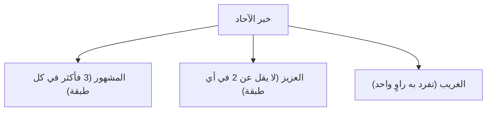
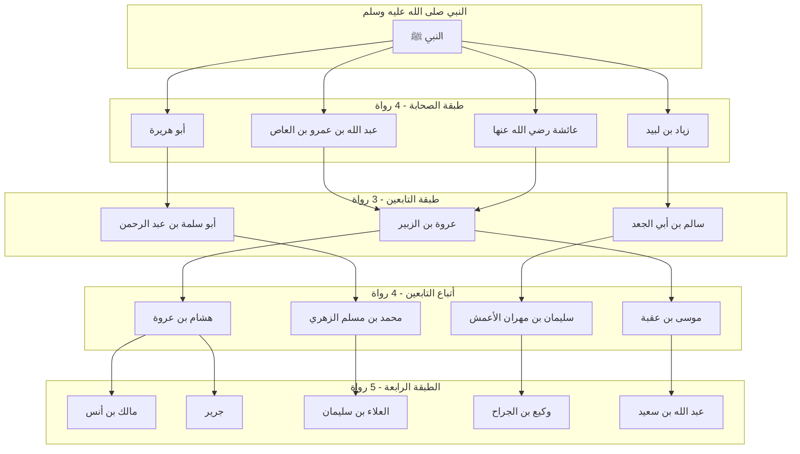

# 03 - خبر الآحاد والحديث المشهور والمستفيض

> **المحاضرة:** الثالثة — [[تيسير مصطلح الحديث]] | شرح الشيخ الشوبكي
> **المرجع:** الأسطر 565–971

---

## 1. المبحث الثاني: خبر الآحاد

### تعريف خبر الآحاد

| البيان | التعريف |
|--------|---------|
| **لغةً** | &rlm;الآحاد جمع **أحد** بمعنى الواحد، وخبر الواحد هو ما يرويه شخص واحد. |
| **اصطلاحًا** | &rlm;ما لم يجمع شروط المتواتر، أي هو الخبر الذي لم يبلغ حدّ التواتر مهما بلغ عدد طرقه ما دامت دون التواتر. |

---

### حكم خبر الآحاد وما يفيده من العلم

- الحديث [[المتواتر]] يفيد **العلم الضروري (اليقيني القطعي)** الذي يضطر الإنسان للتصديق به كالمشاهدات.
- أما خبر [[الآحاد]] فيفيد **العلم النظري**:
  - &rlm;العلم النظري: هو العلم المتوقف على **النظر والاستدلال**.
  - يحتاج الباحث إلى النظر في الإسناد، والبحث في أحوال الرواة، والتأكد من استيفاء شروط القبول (الاتصال، العدالة، الضبط، السلامة من الشذوذ والعلة)، ثم يحكم عليه بعد ذلك بالصحة أو الضعف.

---

### أقسام خبر الآحاد باعتبار عدد طرقه

ينقسم خبر الآحاد بالنسبة إلى عدد طرقه ورُواته إلى ثلاثة أقسام:
1. [[المشهور]]
2. [[العزيز]]
3. [[الغريب]]

---

## 2. الحديث المشهور (الاصطلاحي)

### تعريفه

| البيان | التعريف |
|--------|---------|
| **لغةً** | اسم مفعول من **شَهَرَ** الأمر إذا أعلنه وأظهره، وسُمي بذلك لظهوره وانتشاره بين الناس. |
| **اصطلاحًا** | &rlm;ما رواه ثلاثةٌ فأكثر في كل طبقة من طبقات السند، ما لم يبلغ حدّ التواتر. |

> ⚠️ قاعدة ذهبية في المصطلح
> &rlm;«الأقل في هذا العلم يقضي على الأكثر».
> لا بد أن يكون في **كل طبقة** ثلاثة فأكثر؛ فلو جاء في طبقة واحدة راويان فقط وفي باقي الطبقات عشرة، خرج الحديث من المشهور وصار **عزيزًا**؛ لأن العبرة بالطبقة الأقل عددًا.

---

### مثال الحديث المشهور: حديث قبض العلم

قال رسول الله ﷺ:
> &rlm;«إنّ الله لا يقبضُ العلمَ انتزاعًا ينتزعه من صدور العلماء، ولكن يقبضُ العلمَ بقبضِ العلماء، حتى إذا لم يبقَ عالمًا، اتخذ الناسُ رؤوسًا جُهّالًا، فسُئلوا فأفتوا بغير علمٍ، فضلّوا وأضلّوا».

#### شجرة إسناد الحديث وطبقاته

- **الصحابة (4):** عبد الله بن عمرو، أبو هريرة، زياد بن لبيد، عائشة رضي الله عنهم.
- **التابعون (3):** عروة بن الزبير (عن ابن عمرو وعائشة)، أبو سلمة (عن أبي هريرة)، سالم بن أبي الجعد (عن زياد).
- **أتباع التابعين (4):** هشام بن عروة وموسى بن عقبة (عن عروة)، ابن شهاب الزهري (عن أبي سلمة)، الأعمش (عن سالم).
- **الطبقة الرابعة (5):** مالك بن أنس وجرير (عن هشام)، العلاء بن سليمان (عن الزهري)، وكيع بن الجراح (عن الأعمش)، عبد الله بن سعيد (عن موسى بن عقبة).
- **الطبقة الخامسة فما بعدها:** إسماعيل بن أبي أويس (عن مالك)، قتيبة بن سعيد (عن جرير)، محمد بن عمرو (عن العلاء)، عبد الله (عن وكيع)، بكر بن صدقة... ثم أصحاب الكتب المصنفة كالترمذي والبخاري ومسلم والطبراني.

> 💡 ملحوظة دقيقة حول حساب الطرق
> العبرة في حساب عدد الرواة هي **بالأشخاص والأعيان** لا بمجرد الروايات؛ فلو روى شخص واحد عن صحابيين حُسب شخصًا واحدًا في طبقته. ولو روى اثنان عن صحابي واحد حُسبا شخصين في طبقتهما.

---

### فائدة حديثية: أئمة تدور عليهم الأسانيد

أشار المحاضر إلى أن هناك ستة أئمة كبار مشهورين تدور عليهم أسانيد السنة النبوية، وقلّ أن تجد إسنادًا يخلو من أحدهم:
- **سليمان بن مهران الأعمش**
- **محمد بن مسلم بن شهاب الزهري**
- **قتادة بن دعامة السدوسي**
- **الحمادان:** حماد بن سلمة وحماد بن زيد
- **شعبة بن الحجاج** (أمير المؤمنين في الحديث)

---

## 3. مفهوم الطبقات والكتب المصنفة فيها

### كيف تُعرف طبقة الراوي؟
- تُعرف الطبقة من خلال **كتب تراجم الرجال وتواريخهم** (مثل: *سير أعلام النبلاء* للذهبي، و*تاريخ بغداد* للخطيب البغدادي).
- من خلال معرفة سَنَتَي ولادة الراوي ووفاته وشيوخه وتلاميذه، يُحدد موقعه وطبقته.

### كتاب تقريب التهذيب للحافظ ابن حجر
- قسم الحافظ [[ابن حجر العسقلاني]] رواة الكتب الستة إلى **12 طبقة**.
- أصله كتابه الموسع *تهذيب التهذيب* (11 مجلدًا)، ثم اختصره في مجلد لطيف جامع هو **[[تقريب التهذيب]]**، وهو كتاب لا يستغني عنه طالب علم الحديث.
- تنتهي سلسلة الطبقات عند **أصحاب الكتب المصنفة** (كأحمد والبخاري ومسلم وأبي داود والترمذي والنسائي وابن ماجه).

---

## 4. الحديث المستفيض

### تعريفه

| البيان | التعريف |
|--------|---------|
| **لغةً** | اسم فاعل من **استفاض**، مشتق من **فاض الماء** إذا كثر وسال، وسُمي بذلك لانتشاره وسيلانه. |
| **اصطلاحًا** | اختلف أهل العلم فيه على **ثلاثة أقوال**: |

1. **القول الأول:** هو **مرادف للمشهور**؛ فلا فرق بين المستفيض والمشهور.
2. **القول الثاني:** هو **أخصّ من المشهور**؛ لأنه يشترط فيه أن **يستوي طرفا إسناده** (أو تتساوى جميع طبقاته)؛ فإذا بدأ بثلاثة انتهى بثلاثة في كل طبقة، بخلاف المشهور الذي قد يختلف فيه العدد بين الطبقات (كأن تكون طبقة 3 وطبقة 4 وطبقة 5).
3. **القول الثالث:** هو **أعمّ من المشهور** (عكس القول الثاني).

> 📌 موضعه في التقسيم
> المستفيض يندرج تحت قسم **المشهور**، إما مرادفًا له أو نوعًا خاصًا منه.

---

## 5. المشهور غير الاصطلاحي (الشهرة على الألسنة)

### تعريفه
- &rlm;المشهور غير الاصطلاحي: هو ما اشتهر وجرى على ألسنة الناس دون اعتبار للشروط الاصطلاحية للمحدثين (أي دون اشتراط 3 في كل طبقة).
- قد يكون له إسناد واحد، أو أكثر من إسناد، **أو لا إسناد له بالكلية (لا أصل له)**.

### أصنافه وأمثلته بحسب البيئات والعلوم

| الصنف | مثال الحديث المشهور فيه | حكمه الإسنادي |
|-------|--------------------------|---------------|
| **بين أهل الحديث خاصة** | حديث أنس رضي الله عنه: أن النبي ﷺ قنت شهرًا بعد الركوع يدعو على رِعْل وذَكْوان. | صحيح ثابت |
| **بين أهل الحديث والعلماء والعوام** | &rlm;«المسلم من سَلِم المسلمون من لسانه ويده». | صحيح متفق عليه |
| **بين الفقهاء** | &rlm;«أبغض الحلال إلى الله الطلاق». | ضعيف (مرسل) |
| **بين الأصوليين** | &rlm;«رُفِع عن أمتي الخطأ والنسيان وما استُكرهوا عليه». | صححه جمع من العلماء، يستدلون به في رفع الإثم والحرج |
| **بين النُحاة** | &rlm;«نعم العبدُ صُهَيب لو لم يخفِ الله لم يَعْصِه». | لا أصل له مرفوعًا |
| **بين العامة (العوام)** | &rlm;«العَجَلةُ من الشيطان». | أخرجه الترمذي وحسنه |

---

## 6. حكم الحديث المشهور (الاصطلاحي وغير الاصطلاحي)

- المشهور (اصطلاحيًا كان أو غير اصطلاحي) **لا يوصف بالصحة ولا بالضعف لذاته** لمجرد كونه مشهورًا.
- قد يكون المشهور:
  - **صحيحًا**
  - **حسنًا**
  - **ضعيفًا**
  - **موضوعًا (مكذوبًا لا أصل له)**
- لكن إذا **صحّ** الحديث المشهور الاصطلاحي، كانت له **مزيّة ترجيحية** تقدمه على العزيز والغريب عند التعارض؛ لتعدد طرقه وقوتها.

---

## 7. أشهر المصنفات في الأحاديث المشهورة

صنف العلماء كتبًا لجمع الأحاديث **المشهورة على الألسنة** (المشهور غير الاصطلاحي) لتمييز الصحيح منها من الضعيف والموضوع، ولم يفردوا كتبًا للمشهور الاصطلاحي:

| الكتاب | المؤلف | ملحوظة |
|--------|--------|--------|
| **المقاصد الحسنة فيما اشتهر على الألسنة** | الإمام شمس الدين السخاوي (تلميذ الحافظ ابن حجر) | من أجمع وأدق كتب الباب |
| **كشف الخفاء ومزيل الإلباس عما اشتهر من الأحاديث على ألسنة الناس** | الشيخ إسماعيل بن محمد العجلوني | كتاب مطول ومشهور جدًا |
| **تمييز الطيب من الخبيث فيما يدور على ألسنة الناس من الحديث** | ابن الدَّيْبَع الشيباني | اختصار لمقاصد السخاوي |

> ⚠️ التفريق بين الإطلاق والتقييد
> - إذا قال المحدثون في كتبهم: **«هذا حديث مشهور»** وأطلقوا؛ فالمراد **الشهرة الاصطلاحية**.
> - وإذا قيّدوا فقالوا: «مشهور عند العوام» أو «مشهور عند الفقهاء»؛ فالمراد **الشهرة غير الاصطلاحية**.

---

<b>النص الكامل للمحاضر (تفريغ صوتي: الأسطر 565–971)</b>

تمام حد عنده سؤال في المتواتر؟ المتواتر يبقى برض عليه يا جماعه 

نعم يا شيخ 

في حاجه اسمها اجماع يعتبر هو اجماع ولا 

يعني ايه الاجماع 

في كتب بقى مجموعه يا جماعه كتاب اسمه الاجماع اللي هو اجتمع عليه الامه هو 

الاجماع مصطلح خاص بالفقه خاص بالاحكام الفقهيه ليس خاصا بالاحاديث قلنا المتواتر ان ثبت انه متواتر خلاص لكن مساله الاجماعات وكتب الاجماع انما تعتني بالاقوال الفقهيه الحكم الذي لم يختلف فيه ماشي مش بالاحاديث المبحث الثاني خبر الاحاد لغه الاحاد جمع احد بمعنى الواحد وخبر الواحد ما يرويه شخص واحد واصطلاحا هو ما لم يجمع شروطا متواتبه يبقى الاحاد هو الذي لم يبلغ مبلغ ايه التواتر حكمه قلنا الحديث المتواتر يفيد العلم ايه؟ 

الضروري 

الضروري ده بقى يفيد العلم النظري ايه العلم النظري العلم المتوقف على النظر والاستدلال لازم استدل وافكر واتامل حتى يحصل لي العلم بهذا الحديث لان انا محتاج ان انا اشوف هو صح ولا غلط صحيح ولا ضعيف فابحث في سنده وانظر في رجال ورواته وبعد ذلك اشوفه استوفى الصحه ولا لا واحكم عليه بعد ذلك وكل تقسيم باعتبار وساذكر هذين التقسيمه هيبدا بقى معايا تقسيم خبر الاحاد بالنسبه الى عدد طرقه كم قسم مشهور 

مشهور عزيز 

وعزيز وغريب 

الاول المشهور وهو لغه اسم مفعول من شهر الامر اذا اعلنته واظهرته وسمي بذلك لظهوره يبقى كلمه مشهور معناها ان هو ايه 

انتصر 

انتشر واشتهر وعرف بين الناس واصطلاحا ما رواه ثلاثه فاكثر في كل طبقه ما لم يبلغ حد التواتر يبقى قلنا يا اخو في كل طبقه من طبقاته ثلاثه في ايهكثر 

لو جاف طبقه وقل عن ثلاثه ما يبقاش مشهور يبقى عزين 

على حسب ما هو كان بالظبط فقلنا ان اقل حاجه هي الحاكمه في هذا البان فلا بد ان يكون في كل طبقه ثلاثه فايه 

فاكثر 

طيب مثاله حديث ان الله لا يقبض العلم انتزاعا ينتزعه من صدور العلماء ولكن يقبض العلم بقبض العلماء حتى اذا لم يبق عالما اتخذ الناس رؤوسا جهالا فسئلوا فافتوا بغير علم فضلوا نعوذ بالله من ذلك تعال بقى نشوف الشيخ لما عمل لنا مخطط جميل لايه لحديث ا ان الله ليقبض العلم مشهور يا شيخ مستفيض 

على راي وهو المستفيض على راي وبعضهم يقول لا المستفيض حاجه ثانيه المستفيض ما ما تساوى طرف اسناده او زيها حلو يا جماعه 

بيقول ايه 

بيقول الاخ يعني كويس يعنينا شوف انتوا عايزين 

ش ولا ش 

عدد اطراف وعد يعني تساوي عدد عدد الرواه 

اللي هو ايه؟ 

اللي هو الحديث اللي هوكلم فيها 

مستفيض ما يكون كله حاجه واحده اوله زي اخره هنا لاثه هنا لاثه هنا لاثه هنا لاه 

لكن المشهور ممكن يكون لاثه هنا اربعه خمسه بيبقى بيلعب في اكتر من لاثه 

لكن المستفيض لازم يبقى كله حاجه واحده استوى طرف 

بس برض في في حدود الثلاثه او الاربعه الحديث اللي معانا ان الله لا يقبض العلم انتزاعا جاء عن النبي صلى الله عليه وسلم صلى الله عليه وسلم 

رواه من اصحاب النبي صلى الله عليه وسلم 

صلى الله عليه وسلم 

اربعه اشهرهم عبد الله بن عمرو عبد الله بن 

عمرو 

ابن عمرو بن العاص رضي الله عنه وابو هريره 

رواه كذلك وزياد بن لبيد صحابي ايضا و عائشه رضي الله عنها وار يبقى كده في اول طبقه تحقق ان هو اربعه ولا لا 

نعم 

واحنا قلنا المشهور ثلاثه فايه 

طيب نيجي الطبقه اللي بعدها رواه عن عبد الله عروه 

ابن الزبير 

ابن الزبير ورواه عن ابي هريره ابو سلمه ورواه عن زياد سالم ابن ابي الج وايضا رواه عن عائشه عروه وطبعا عروه معانا فهيبقى كده مكرر يبقى كده رواه كام واحد هنا في الطبقه دي 

لاه 

ثلاثه قل ولا زي ما هو 

قل يعني عن ثلاثه لا مشكور 

ممكن اسال سؤال سيد 

قول 

لو حد يعني ايه من التانيين دول روع عن الصحابي تاني 

ما فيش مشكله ما كله اصلا رو عن صحابه تاني 

مش الاصدق يعني مثلا ايه ابو سلمه ما روش عن ابو هريره مثلا عن ايه عن عبد الله بن عمراني 

اه ماشي 

هكر قصدي كده الاثنين ايه 

لا يعتبر لا يعتبر لا يعتبر طريقان طريق واحد 

طريق واحد 

لان هو نفس الشخص نفس الشخص اللي رواه 

لم يختلف الشخص لم يختلف ايه 

الشخص 

لم يختلف الشخص لازم يبقى ايه قلنا ما رواه ثلاثه 

طب طب هو لو مثلا هو ابو سلمى هو عن عن عبد الله بن عم كده تحسب اثنين قول 

تاني كده اه 

نفس الصحابه 

اه الاثنين يبرو يبقى اه يبقى الاثنين بالاشخاص 
 كده ينقص في طبق الصحابه صح 

اه هنا في طبق الصحافه كده لو اثنين رو عن واحد 

هو ده يا سيدنا حت لي ده كده يبقى مش نفس الطريق نفس الطريق 

بتقول نفس الاسم 

انت قلت ابو سلمه روا عن ابن عمرو 

وعروه رواه عن عبد الله بن عمرو برض كده ايه هما الاثنين 

يبقى يبقى ده يبقى ده اثنين 

اه بس رو عن نفس الصحابه 

انا احسبك بتقول ان ابو سلمه رواه عن رواه عن ابو هريره وروى عن ابن فيبقى تحسب واحد لا لو يبقى العبره بالاشخاص الاشخاص كام 

اثنين 

يبقى اثنين العبره بالاشخاص 

تمام 

العبره بالاشخاص بس ده لو رواه هنا ورواه هنا ورواه هنا هو برض شخص واحد 

تمام 

وصلت ولو الاثنين رووا عن واحد يبقى اثنين 

تمام 

تمام عبره بالاشخاص طيب ثم رواه عن عروه هشام ابنه هشام بن عروه 

بنه 

ورواه عن ابو سلمه الزهري 

محمد بن مسلم 

ورواه عن سالم الاعمش 

هي دي فايده لشيخنا في موضوع ان الواحد يعرف علماء المشايخ 

ورواه عن عروه موسى بن عقبه فائده ايه 

ها 

فايده ايه 

يعني انا اعرف مثلا علماء الاعمشين 

ايوه طبعا هتعرف من خلال السنه بس انا ده مش اللي انا عايزه انا عايزك تعرفه دلوقتي انا عايزك تعرفه دلوقتي ان مش مشهور 

عايز انت تاخد فايده زياده براحتك انت عرفت اهو ان الاعمى الشيخ سالم بن ابي الجعد 

مثلا بس انت محتاج بقى تعمل بقى تعمل مسبار بقى لهذا اعمش من المكثرين اصلا مكثرين جدا 

مكثرين في المشايخ اللي في المحترف 

اه الاثنين روى كثيرا كان من السته الذين تدور عليهم الاسانيد في عندك ناس بتدور عليهم اسانيد يعني ايه يعني هتلاقي الاسانيد كلها لازم هتلاقي الراجل ده في النص 

ما شاء الله 

الاعمش ما شاء الله 

قتاده 

الزهري 

الزهري ا مين تاني منهم سلين 

لا لا الاعمش وقتاده والحماد حماد بن سلمه وحماد بن زيد 

تكتبهم فوق 

ممكن واحد لا لا اظبطهم كلهم تمام ففي ناس تدور عليهم الاسانيد لن تجد اسنادا يخلو من هؤلاء لن تجد اسنادا يخلو من ايه شعبه بن الحجاج برض اظن منه تمام هنا بقى هشام والزهري والاعمش والس كام؟ 

اربعه 

يبقى انا عندي هنا اربعه عندي هنا ثلاثه عندي هنا كام؟ 

اربعه 

اربعه تمام ثم اخذ عن هشام مالك 

واخذ عن الزهري العلاء 

كمان هشام خد عنه اثنين ملك بن انس وجرير 

والزهري اه طبعا هو الامام العلاء ابن سليمان شغلنا الشعر يا شيخ 

زي الطبري 

لا لا جرير لا مش جرير الشاعر لا ادري من هو جرير 

لكن ما اعتقدش الشاعر المشرات دي 

واخذ عن الاعمش وكيع 

الجراح الشيخ الشافعي 

واخذ عن موسى بن عقبه عبد الله 

ابن سعيد تقول ايه عايز تقول ايه يا شيخ البخاري شيخ البخاري منين 

اه ده جبته الشيخ 1 ا 3 ا خ يبقى كده كام 

خمسه تمام ثم اخذ عن مالك ابن ابي اويس شوف بقى بعد ابن ابي ويس هيجي البخاري البخاري هيبقى تلميذ ابن ابي ويس واخذ عن جرير يبقى بنيس خد عن مالك وجرير خد عنه قتيبه بن سعيد والعلاء خد عنه محمد بن عمرو عن ابيه وكيع خد عنه عبد الله 

عن ابيه عبد الله بن سعيد خد عنه بكر ابن صدقه يبقى كام واح ا 3 ا خز 

ثم اخذ عن هذا عن مالك البخاري وعن جرير مسلم وعن وكيع الطبراني وعن عبد الله بن سعيد لا عن عن العلاء الطبراني وعن وكيع وعن بكر الخطيب سيدنا 

اظن الفكره واضحه 

ملم بالاسماء ديت على على قدر يعني الثقه في كلامهم مثلا هم التابعين التتابعين ابقى عارف ازاي يعني 

بمعنى الطبقه الناس الطبقه دي اعرفها ازاي او انا احفظها ازاي او ابقى عارف ازاي ولا ماليش ان انا ابحث بس بقى احاديث ثانيه علم 

يا عم اسمعني بس خليني اعرف بس سؤاله عشان اعرف اجاوب عليه حضرتك 

ايه 

هلاقي في احاديث ثانيه رواه تانيين غير الرواه فانا هبقى عارف دوت 

هو قصده يحفظ الاسامي دي كلها ازاي يعني 

بس هو ده المقص مش مطالب انك تحفظ الاسماء مش مطالب الا اذا كنت رجل مط تخصص وعندك درب مع مع هذا العلم ففي اسماء تتحفظ غصبا عنك حد ما يعرفش الاعمش لا 

حد ماعرفش شعبه 

قرات 

حد ما يعرفش سفيان وحماد وحماد حد ما يعرفش وكيع بن الجراح حد ما يعرفش سفيان بن عينه سفيان الثوري وهكذا في اسماء قتاده ا القب 

مالك نافع ابن عمر سالم فكل دول معروفين 

مسعر ابن كلان معروفين عند اهل الصنعه طيب في كتب اسمها كتب ا تتعلق بتراجم الرجال زي سير اعلام النبلاء وزي تاريخ بغداد وزي التواريخ كتب التواريخ من هذه الكتب تقدر تجيب اسم الراوي وهو عاش من سنه كام لسنه كام وبناء على السنين التي عاشها تحدد طبقته في الاسلام تحدد طبقته فين 

يعني طبقه الصحابه مثلا ممكن تنتهي عند ال 100 طبقه ما بعد الصحابه تنتهي عند 100 وحاجه او 200 طبقت وهكذا فتجعل الطبقات وابن حجر رحمه الله قسم الطبقات دي ل 12 طبقه 

في كتابه تقريب التهذيب 

تقريب التهذيب 

تقريب التهذيب مجلد واحد عمل طبعا كتاب تهذيب التهذيب وبعد كده عمل تهذيب التهذيب ده في 11 مجلد اختصره في كتاب واحد في تقريب التهذيب وهو لا يستغنى عنه طالب علم الحديث معايا مشيخ 

والطبقات دي يا شيخه بتقف عند 

يعني سنه معينه مثلا 

اصحاب الكتب 

اصحاب الكتب 

اصحاب الكتب المصنف ما دام ان الحديث وضع في كتاب المصنف فخلاص انتهت روا انتهى تقريب التذيب ده ابن حجر 

ابن حجر العس 

تقريب 

تقريب التب تمام كده يا مشايخ فهمتوا الحديث المشهور 

نعم 

فهمتوه 

نعم المصنفات دي لازم دي طبق راضي ولا خلاص طالما بقى في البخاري بس مثلا خلاص كده يعني مش لازم يبقى في واحد 

لا المصنفات على طبقات طبقه احمد متقدمه عن طبقه البخاري طبقه النسائي متاخره طبقه البيهقي متاخره 

ما دام ان هو ايه 

متقدمه في الازمنه ولا متقدمه في الصحه عند العلماء 

لا في الازمنه اكلم على الازمنه دلوقتي 

تمام 

مش في الصح ان الطبراني ا الطبراني 360 البخاري 256 احمد 241 ا ا النسائي 303 فتلاقيهم ايه؟ دول طبقات متاخرين فكل واحد من دول طبقه واللي قبله بقى طبقات يعني ممكن تلاقي البخاري مثلا اعلى سند عنده اطول سند عنده مثلا ست من ست لسبع اشخاص بينه وبين النبي مسلم يوصل ل 10 بينه وبين النبي وسلم 10 

غيره ممكن يبقى 11 و1 بينه وبين النبي صلى الله عليه وسلم فدي طبقات بتزيد معهم بسبب تاخرهم وبعدهم عن زمن النمو او زمن المف 

المستفيض لغه اسم فاعل من استفاضه مشتق من فاض الما وسمي بذلك الانتشابه واصطلاحا اختلف في تعريفي على ثلاثه اقوال وهي اولا انه مرادف للمشهود بعضهم قال ان الحديث المستفيض ده هو ايه 

المشهور 

ما فيش خلاف بينهم وبعضهم قال اخص منه لانه يشترط في المستفيض ان يستوي طرف اسناده ولا يشترط ذلك في المشهور دول طرف اسناد بعضهم قال اول السند واخر السند لو هنا لو فوق ثلاثه يبقى اخر ايه في الاخر ايه 

ثلاثه مش مهم اللي بينهم وبعضهم قال في كله يكون ايه بعدد واحد لا يختلف 

لكن هنا لما قلنا قلنا اربعه وثلاثه واربعه وخمسه كلهم في اطار لاثه فاكثر صح لكن ممكن يختلف قال لك ده ما سماش مستقيض بقى المستقيض لازم يبقى ايه 3لاه 3 3 ا خ وهكذا لا يقل ولا ا يختفي تمام فهمت يا عم الشيخ انت قلت التقسيمه الاحاد مشهور وغريب و 

عزيز وغريب 

عزيز وغريب حضرتك المستفيض ده تبع انهي مجموعه 

المستفيض هتحطه تحت المشهور 

اه تحت 

اما ان يكون هو المشهور واما ان يكون 

مستفيض 

ا قريبا من المشهور 

مستفيض اللي هو قلت اربعه ولا 

ما قلناش اربعه قلنا هيبقى مره واو ثلاثه فاكثر بس ايه 

لازم لو لو في طبقه اربعه يبقى كله اربعه في طبقه خمسه يبقى كله خمسه في طبقه سته يبقى كله سته طبقه ما يقلش عن لاثه بس يبقى متكرر زي ما هو بالضبط في كل الطبقات لا يختلف فهمت ولا ما فهمتش 

تمام يا سنا اكيد ا اللي بعده روى عنه يعني مش هينفع يبقى اربعه جايين فثلاثه يروي عنهم بعد كده فيبقى اربعه لاثه صح 

ليه ما ممكن واحد ياخد من اثنين 

تمام كده بس وبعدين اهو ما احنا جايبين لك لاه اربعه خمسه اهو 

انت كنت معانا فين واحنا بنش على المشهور اهو 

ايوه يا استاذ 

اهو 

ماشي 

تقول لي مش معقول ومش معقول تقعد تعملها لي بعقلك بدماغكس 

سب غلط وقيل هو اعم منه اي هو عكس القول الثاني طيب اعم منين 

من المشهور يعني المشهور ينبغي ان هو يكون مستفيض والمستفيض يكون مشهور يعني المشهور يكون لاثه لاثه كل كل ما ورد في اول السند هو يعمم في اخر السند 

لاه نخلي المستفيض مشهور والمشهور مستفيض المستفيض مستوى اتراف 

ام كل مشهور مستوه اسمها الشهره الاصطلاحيه اسمها ايه يا عم الشيخ 

الشهره الاصطلاحيه 

الشيخ اللي جنبك نام الشهره ايه 

الاصطلاحيه 

الاصطلاحيه يعني بمعنى المصطلح عند المحدثين في بقى مشهور غير اصطلاحي اسمه مشهور ولكنه غير اصطلاحي ويقصد به ما اشتهر على الالسنه من غير شروط تعتبر ده بقى اسمه المشهور عند الناس مش المشهور عند المحدثين المشهور عند ايه 

عند الناس 

فيقول لا ما له اسناد واحد وله اكثر من اسناد ولا يوجد له اسناد اصلا 

حاجه معج 

اه مافيش بقى اللي هو مش لاثه فاكثر ده ممكن ما يبقاش ليه اسناد اصلا 

ضعيف 

اه وله انواع اشهرها المشهور بين اهل الحديث خاصه مثاله حديث انس ان رسول الله صلى الله عليه وسلم قنت شهرا بعد الركوع يدعو على رعك وذكواه حديث القنود بقى لما دول خانوا اصحاب النبي صلى الله عليه وسلم وقتلوهم فالنبي صلى الله عليه وسلم جلس شهرا يدعو عليه ده مشهور عند المحدثين مشهور بين اهل الحديث والعلماء والعوام مثال المسلم من سلم المسلمون من لسانه ويده مشهور بين الفقهاء كل الفقهاء يعرفونه اب غض الحلال الى الله الطلب مشهور بين الاصوليين رفع عن امتي الخطا والنسيان وما استكروا عليه لان هم بيستخدموه كتير في مساله رفع الاثم ورفع الحرج ورفع الجناح بقى 

يعني ده صحيحنا انت حضرتك بتقوله 

ان هو ايه 

اللي هو الاحاديث اللي رواتها ورا بعضها دلوقتي 

قلت لك دول ده اصلا قال لك لا يشترط فيهم الصحه 

يعني اصلا 

ممكن يكون بعضه صحيح وممكن يكون بعضه ضعيف 

حديث انس ده صحيح المسلم من سلم صحيح ابغض الحلال مرسل رفع الخطا والنسون برض وفي كلام ان كان صححه بعض العلماء مشهور بين النحاه مثل حديث نعم العبد صهيب لو لم يخف الله لم يعصه وهذا لا اصل له مشهور بين العامه وهو حديث العجله من الشيطان اخرجه الترمذي وحسنه المشهور الاصطلاحي وغير الاصطلاح لا يوصف قلنا بقى يا اخوه كلمه ان الحديث مشهور مش معناه ان هو صحيح او ضعيف ممكن يكون صحيح او حسن او ضعيف لان هو احنا ما بنبحثش في اسناده بنبحث في عدد ايه؟ في عدد الطرق التي وصلت لكن بعد البحث يتبين ان منه الصحيح ومنه الحسن منه الضعيف ومنه الموضوع لكن ان صح المشهور الاصطلاحي فتكون له ميزه ترجعه للعزيز والملي طيب لما يكون الحديث المشهور صحيح بيبقى اقوى ولا لا؟ 

اقوى 

لانه ليه ثلاث اربع طرق 

فيبقى اقوى من ليه طريق واحد او طريقين 

اشهد المصنفات صنف في الاحاديث المشهوره اي المشهوره على الالسنه وليست المشهوره اصطلاحا المصنف اللي احنا بنتكلم عنها دي بقى مش في المشهور اصطلاحا ده في المشهور ايه 

على الالسنه 

لفظا يعني في منه وضع متدا 

على الالسنه 

تداول تداول 

اللي تداول بين الناس 

---

← [[02 - الخبر المتواتر تعريفه وشروطه وأقسامه ومصنفاته|الجزء السابق]] | [[00 - الفهرس والخطة|الفهرس]] | [[04 - الحديث العزيز والغريب بنوعيه المطلق والنسبي|الجزء التالي]] →

---

> 📊 **إجمالي الأجزاء:** 4  
> **الجزء الحالي:** 3 / 4  
> **المتبقي:** جزء واحد
