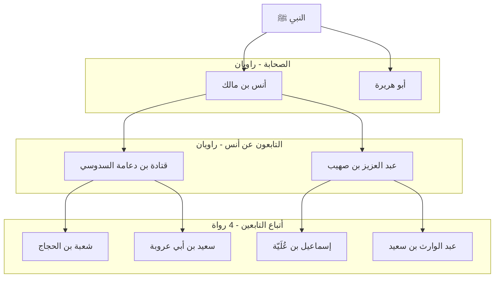
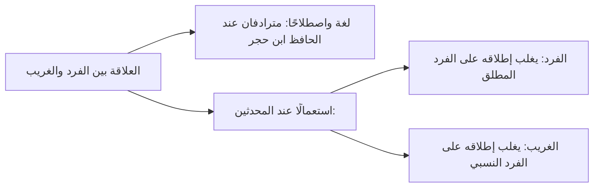
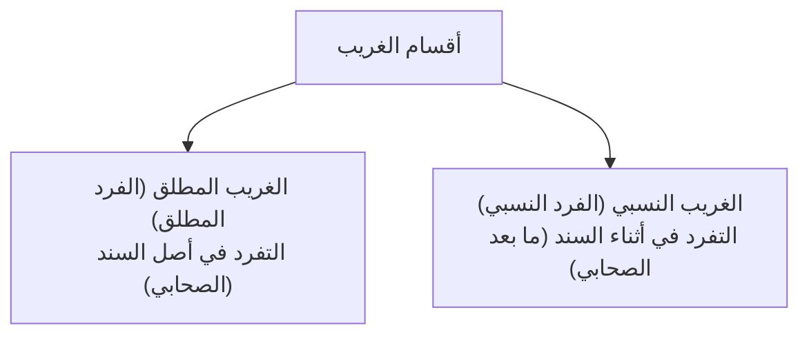

# 04 - الحديث العزيز والغريب بنوعيه المطلق والنسبي

> **المحاضرة:** الثالثة — [[تيسير مصطلح الحديث]] | شرح الشيخ الشوبكي
> **المرجع:** الأسطر 972–1201

---

## 1. الحديث العزيز

### تعريفه

| البيان | التعريف |
|--------|---------|
| **لغةً** | صفة مشبهة من:  1. **عَزَّ يَعِزُّ** (بكسر العين): أي قَلَّ ونَدَرَ.  2. **عَزَّ يَعَزُّ** (بفتح العين): أي قَوِيَ واشتَدَّ.  وسُمي بذلك إما لقلة وجوده وندرته، وإما لقوته بمجيئه من طريق ثانٍ يشد عضده. |
| **اصطلاحًا** | &rlm;ألا يقلّ رواته عن اثنين في جميع طبقات السند. |

> ⚠️ قاعدة ضابطة
> معنى «ألا يقل عن اثنين» أنه لا توجد أي طبقة في السند فيها راوٍ واحد؛ فإن وُجد في بعض الطبقات ثلاثة أو أربعة أو أكثر فلا يضر، بشرط أن تبقى ولو طبقة واحدة فيها راويان فقط؛ لأن:
> &rlm;«العبرة في الحكم للطبقة الأقل عددًا في السند».

### الخلاف والراجح في تعريف العزيز
- **الراجح (تحرير الحافظ ابن حجر):** ألا يقل عن اثنين في أي طبقة.
- **قول مرجوح:** قال بعضهم: العزيز هو رواية اثنين أو ثلاثة (فلم يفصلوا بينه وبين المشهور بدقة).

---

### مثال الحديث العزيز: حديث محبة النبي ﷺ

قال رسول الله ﷺ:
> &rlm;«لا يؤمنُ أحدُكم حتى أكونَ أحبَّ إليه من والدِه وولدِه والناسِ أجمعين».

- **طبقة الصحابة (2):** أنس بن مالك رضي الله عنه، وأبو هريرة رضي الله عنه.
- **طبقة التابعين عن أنس (2):** قتادة بن دعامة السدوسي، وعبد العزيز بن صهيب.
- **طبقة أتباع التابعين (4):**
  - عن قتادة: شعبة بن الحجاج، وسعيد بن أبي عروبة.
  - عن عبد العزيز: إسماعيل بن عُلية، وعبد الوارث بن سعيد.
- زاد العدد بعد ذلك في الطبقات التالية؛ فحكم للحديث بأنه **عزيز** لوجود طبقتين متتاليتين فيهما اثنان فقط.

---

## 2. الحديث الغريب (والفرد)

### تعريفه

| البيان | التعريف |
|--------|---------|
| **لغةً** | صفة مشبهة بمعنى **المنفرد**، أو البعيد عن أقاربه ووطنه. |
| **اصطلاحًا** | &rlm;ما ينفرد بروايته راوٍ واحد في أي طبقة من طبقات السند. |

- يستقل بروايته شخص واحد، إما في كل طبقات السند أو في طبقة واحدة منها.
- لا تضر كثرة الرواة بعد الراوي المتفرد (لأن الأقل يقضي على الأكثر).

---

### هل الغريب والفرد مترادفان؟

---

## 3. أقسام الغريب باعتبار موضع التفرد

ينقسم الغريب باعتبار مكان التفرد في السند إلى قسمين رئيسيين:

### أولًا: الغريب المطلق (الفرد المطلق)

- &rlm;تعريفه: ما كانت الغرابة في **أصل سنده**؛ أي أن ينفرد بروايته راوٍ واحد في طرف السند الذي فيه الصحابي (الراوي المباشر عن النبي ﷺ).
- **مثاله الشهير:** حديث &rlm;«إنما الأعمال بالنيات وإنما لكل امرئ ما نوى...»
  - تفرد به عن رسول الله ﷺ أمير المؤمنين **عمر بن الخطاب** رضي الله عنه.
  - ثم تفرد به عن عمر: **علقمة بن وقاص الليثي**.
  - ثم تفرد به عن علقمة: **محمد بن إبراهيم التيمي**.
  - ثم تفرد به عن محمد: **يحيى بن سعيد الأنصاري**.
  - ومن بعد يحيى بن سعيد انتشر ورواه أكثر من مئتي راوٍ.

---

### ثانيًا: الغريب النسبي (الفرد النسبي)

- &rlm;تعريفه: ما كانت الغرابة في **أثناء سنده**؛ بأن يرويه جمع من الصحابة والتابعين، ثم ينفرد بروايته راوٍ واحد عن أولئك الرواة في طبقة لاحقة.
- **سبب تسميته نسبيًا:** لأن التفرد لم يكن مطلقًا عن النبي ﷺ، وإنما وقع بالنسبة إلى راوٍ معين أو بلد معين أو صفة معينة.
- **مثاله:** حديث: &rlm;«أن رسول الله ﷺ دخل مكة عام الفتح وعلى رأسه المِغْفَر»
  - رواه الإمام مالك عن ابن شهاب الزهري عن أنس بن مالك رضي الله عنه.
  - التفرد هنا وقع من **الإمام مالك عن الزهري**؛ فيُقال: تفرد به مالك عن الزهري (غرابة نسبية لشخص مالك).

---

## 4. أنواع الغرابة النسبية الخاصة

تأتي الغرابة النسبية على صور متعددة تذكر في كتب العلل والأطراف:

| النوع | صيغته ومثاله | الشرح |
|-------|--------------|-------|
| **تفرد ثقة** | «لم يروه ثقة إلا فلان» | رواه جماعة من الضعفاء، وانفرد بروايته من الثقات راوٍ واحد. |
| **تفرد راوٍ عن راوٍ** | «تفرد به فلان عن فلان» | كأن يقال: تفرد به مالك عن الزهري، وإن كان مرويًا عن غير الزهري. |
| **تفرد أهل بلد أو جهة** | «تفرد به أهل الشام» أو «أهل مكة» | لم يروِ هذا الحديث إلا علماء قطر أو بلد معين. |
| **تفرد أهل بلد عن أهل بلد آخر** | «تفرد به أهل البصرة عن أهل المدينة» | سلسلة الإسناد انتقلت حصرًا بين علماء هذين البلدين. |

---

## 5. تقسيم الغريب من حيث غرابة السند والمتن

| القسم | التعريف | المثال والحكم |
|-------|---------|---------------|
| **غريب متنًا وإسنادًا** | الحديث الذي تفرد برواية **متنه** راوٍ واحد في السند. | مثل حديث «إنما الأعمال بالنيات»، لم يروِ متنه عن النبي ﷺ إلا عمر رضي الله عنه. |
| **غريب إسنادًا لا متنًا** | حديثٌ متنُه مشهور معروف رواه جمع من الصحابة، ولكن جاء من طريق غريب انفرد به راوٍ عن صحابي آخر. | هو مقصود الإمام الترمذي حين يقول في جامعه: **«حديث غريب من هذا الوجه»**؛ أي أن المتن محفوظ من وجوه أخرى، وهذا الوجه غريب سنده. |

---

## 6. مظان ومصادر الحديث الغريب

أين توجد الأحاديث الغريبة بكثرة في كتب السنة؟

1. **مسند البَزّار** (المسمى: *البحر الزخار*).
2. **المعجم الأوسط** للإمام الطبراني (رتبه على أسماء شيوخه وجمع فيه المفاريد والغرائب).
3. **المعجم الصغير** للإمام الطبراني (يخرج عن كل شيخ حديثًا أو حديثين غالبًا مما تفرد به).

---

## 7. أشهر المصنفات في الغريب والأفراد

| الكتاب | المؤلف | الوصف |
|--------|--------|-------|
| **غرائب مالك** | الإمام أبو الحسن الدارقطني | جمع ما تفرّد به الرواة عن الإمام مالك بن أنس. |
| **الأفراد** | الإمام أبو الحسن الدارقطني | مصنف جامع في الأحاديث التي وقع فيها التفرد والغرابة. |
| **السنن التي تفرد بكل سنة منها أهل بلدة** | الإمام أبو داود السجستاني (صاحب السنن) | صنف فيه ما تفرد به أهل كل بلد كالبصرة والشام ومصر. |

---

<b>النص الكامل للمحاضر (تفريغ صوتي: الأسطر 972–1201)</b>

لانه لم يؤلف العلماء كتبا احنا كده كده بنقول ان كل المشهور منه صحيح ومنه ضعيف 

لم يؤلف العلماء كتبا في جمع الاحاديث المشهوره الصلاحيه ومن هذه المصنفات المقاصد الحسنه في ما اشتهر على الالسنه الالامام السخاري ده تلميذ ابن حجر كشف الخفاء ومزيل الالباس فيما اشتهر من الح الحديث على السنه الناس للامام العجلوني او للشيخ العجلوني تمييز الطيب من الخبيث فيما يدور على السنه الناس من الحديث لابن الديبع الشيباني فهذه مؤلفات وردت في ايش؟ في المشهور الغير اصطلاحي اللفظ المشهور ده لو احنا شفناه في اي كتاب ده على طول ان هو اصطلاحي ولا غير اصطلاحي 

لفظ مشهور ازاي 

يعني لفظ مشهور شفته مثلا في اي كتاب متقدم او متاخر ده معناه اللي هو الاصطلاحي ولا ممكن ما يبقاش هو الاصطلاحي 

قصدك قصدك ان هو يقول لك هذا الحديث مشهور 

اه مثلا في كتب المتقدمين مثلا 

لو قال مشهور وسكت 

يبقى يعني الشورى الاصطلاحيه 

لو قال مشهور عند العوام مشهور عند المحدثين مشهور عند الاصول قيد يبقى معناها الشهره غير الاصطلاحيه وهي انه اشتهر عند اهل هذا الفن او عند هذا يبقى العبره كلها بالاطلاق والتقليد اطلق يبقى مشهور اصطلاح ما اطلقش وقيد يبقى مشهور عند هؤلاء الناس فقط 

مش مشهور عند غيره طيب تمام ثم ناتي الى العزيز لغه هو صفه مشبهه من عز يعز اي قل وندر وقيل من عز يعز اي قوي واشتد وسمي بذلك اما لقله وجوده وندرته واما لقوته بمجيئه من طريق اخر اما لان هو نادر واما لان هو ايه قوي واصطلاحا الا يقل رواته عن اثنين في جميع طبقات السند يبقى المفروض يا اخوه ان هو لا يقل عن كام 

عن كام يا عم الشيخين 

انط عزيز 

نايم مش معايا 

عزيز اثنين مشان يا شيخنا في عز عزان 

شرحت الاثنين دول يعني ايه عز عز 

عز عز يعز دول اللي كتم 

سحان دول الاثنين بس يقل عن 

الا يقل عن اثنين هو ثلاثه يبقى كده مشهور 

اه 

الا يقل عن اثنين 

طب طب ليه ما نقولش ان هو اثنين هو ما ينفعش يبقى سجاد عن اثنين مشهور واقل من اثنين غيب 

لو احنا قلنا ايه 

هيقول ما يقولش ان هو الحديث هو بقى كل طبقاته اثنين مش 

لا يق نفس السؤال يا سيدنا بس هو الطبقات الثانيه بقى تبقى لاثه وزياده عادي بس يبقى في طبقه فيها اثنين 

او ممكن 

هي دي بقى 

قلنا ان هو الاقل في هذا العلم يقضي على ايه 

على الاكثر 

يعني بدل الارب الاربعه لاه يبقى 4 ا خ ايا يكن بقى اهم حاجه يبقى طبقته طبقته فيها ايه؟ فيها طبقه اثنين ولا يقل عن ايه؟ عن اثن يعني الا يوجد في طبقه من طبقات السند اقل من اثنين اما ان وجد في بعض طبقات السند ثلاثه فاكثر فلا يضبرت 

بشرط ان تبقى ولو طبقه واحده فيها اثنان لان العبره لاقل طبقه من طبقات ايه 

معايا ولا مش معايا ايه 

من طبقات السند 

هذا التعريف هو الراجح كما حرره الحافظ ابن حجر وقال بعض العلماء ان العزيز هو روايه اثنين او ثلاثه فلم يفصلوه عن المشهور في بعض نزعل الكلام الراجح الا يقل عن اثنين مثاله ما رواه الشيخان من حديث انس والبخاري من حديث ابي هريره ان النبي صلى الله عليه وسلم قال لا يؤمن احدكم حتى اكون احب اليه من والده وولده والناس ايه اجمعين نرسم برض الخريطه يا جمالت 

اثرت انت 

حديث لا يؤمن احدكم يا ف تمام رواه من رواه انس اثنان من الصحابه سيدنا انس بن انس بن مالك وسيدنا مين ابو هريره 

ابو هريره يبقى كده اثنين في الطبقه ولا لا؟ 

نعم 

قل عن اثنين لا 

ما قلش عن اثنين رواه عن انس رجلان قتاده ابن نعامه السدوسي وعبد العزيز 

ابن صهيب ده عشان عزيزه سش 

ما تستظرفش يا ظريف 

وروا يبقى كده عندي ايه اثنين اهو واتنين 

الطبق اهو ما جابش طبعا رواه عن ايه عن ابي هريره 

ورواه عن قتاده شعبه ابن الحجاج وسعيد ورواه عن عبد العزيز اسماعيل بن علي وعبد الواد دول كام 

اربعه 

اربعه 

ايوه كل واحد اثنين 

اربعه في الطبقه 

نعم 

يبقى هنا لا يضر ان هم يكونوا بس ايه اهم حاجه ما يقلوش عن كام 

اثنين 

عن اثنين فهذا يحكم للحديث بانه ايه 

بانه عزيز بانه ايه 

عزيز 

ما فيش حاجه 

ايه 

هو ما حدش رو عن 

موجود بس هو ما جابش ماتعرضش ليه ما تعرضش لمن روى عن ايه عن ابي مره هو بيديك يا سيدنا زي ايه مثال له مثال له فهذا الحديث يسمى عزيزا لانه لم يقل رواه او رواته عن اثنين في جميع طبقات سند وان زاد في بعض الطبقات عن ايه على ثم ياتي بقى للكلام اللي هيطول اللي هو الغريب الغريب لغه هو صفه مشبهه بمعنى المنفرد او البعيد عن اقاربه غريب 

واصطلاحا ما ينفرد بروايته راو واحد يبقى ينفرد برواه ايه يا عم الشيخ راوي واحد 

ها 

راوي واحد 

ها 

راوي واحد 

راوي واحد اي هو الحديث الذي يستقل برواه شخص واحد اما في كل طبقه من طبقات السند او في بعض طبقات السند ولو في طبقه واحده ولا تضر الزياده على واحد في باقي طبقات السند لان العبره قلنا بايهقلق 

للاقل 

غريب 

ايه 

لا الكلام الغريب 

والله شكلك غريب بينا والله ايوه الغريب يا عم الحاج تسميه ثانيه له يطلق كثير من العلماء على الغريب اسم اخر وهو الفرد 

يبقى ما يسمى الغريب وما يسمى ايه الفرض 

على انهما مترادفان وغاير بعض العلماء بينهما فجعل كلا منهما نوعا مستقلا لكن الحافظ ابن حجر يعدهما مترادفين لغه واصطلاحا الا انه قال ان اهل الاصطلاح غيروا بينهما من حيث كثره الاستعمال وقلته فالفرض اكثر ما يطلقونه على الفرض المطلق والغريب اكثر ما يطلقونه على الفرض النسبي يعني ايه يعني لو دلوقتي لو الحديث ده رواه صحابي واحد ده اسمه المطلق يبقى يقولون عنه ايه؟ فرض فرض لانه تفرد في اصل السند في طبقه الصحابه طيب لو كانت الغرابه فيما بعد طبقه الصحابه تابعين او من بعدهم 

يبقى يقال له ايه؟ 

يقال له الغريب الغريب لانه فرض نسبي طيب اقسام يقسم الغريب بالنسبه لموضع التفرد فيه الى قسمين غريب مطلق وغريب نسبي ركز معايا الغريب المطلق او سميناه ايه الفرد المطلق تعريف ما كانت الغرابه في اصل سنده اي ما ينفرد بروايته شخص واحد في اصل سنده مثاله حديث انما عمله بنيات تفرد به مين عمر بن الخطاب يبقى لما الصحابي او اللي هو اول واحد في سند بعد النبي صلى الله عليه وسلم 

صلى الله عليه وسلم 

هو اللي ينفرد به يبقى ده اسمه ايه؟ 

غريب مطلق ويطلق عليه بعض العلماء الفرض يطلق عليه ايه؟ 

الفرد 

وهذا قد يستمر التفرد الى اخر السند وقد يرويه عن ذلك المتفرد عدد من ايه؟ من الرواه طيب اما الغريب النسبي او الفرض النسبي تعريفه ما كانت الغرابه في اثناء سنده يبقى مش في اول السند ده فين؟ 

في تاء الطبقه الثانيه او الثالثه او الرابعه اي ان الرؤيه اكثر من راو في اصل سنده ثم ينفرد بروايه راوي واحد عن اولئك الرواه مثاله حديث مالك عن الزهري عن انس رضي الله عنه ان النبي صلى الله عليه وسلم دخل مكه وعلى راسه المغفر تفرد به مالك عن الزهري يبقى مين اللي تفرد به 

مالك 

يبقى هنا التفرد في الطبقه الكام 

التابعين التابعين التابعين 

الرابعه خمسه 

ممكن الثالثه او الرابعه 

الرابعه من حيث ال الاسناد والرابعه من حيث الحقيقه لان الزهري لم يلقى انسايد الغريب 

قد يلقى الغريب 

عشان الزهري انا سمعت متاخر ممكن يلقاه يبقى الثالثه 

الغريب النسبي ما كانت الغرابه 

النسبي ما كانت الغرابه اثناء السند يعني مش في اول السند فاهمين مش يعني مش في الصحابي ما بعد الصحابي 

تمام الشيخ 

نعم يا 

تمام 

تبيعي واحد تبيعي 

اه وسبب تسميه سمي هذا القسم الغريب النسبه لان التفرد وقع فيه بالنسبه الى شخص معين فنقول تفرد به مالك عن الزهري فصار خاصا بمين بشخص معين يبقى اسمه غريب نسبي من انواع الغريب هناك انواع من الغرابه او التفرد يمكن عدها من الغريب النسبي لان الغرابه فيها ليست مطلقه وانما حصلت الغرابه فيها بالنسبه الى شيء معين هذه الانواع هي تفرد ثقه بروايه الحديث كقولهم لم يروه ثقه الا فلان ده اسمه غريب نسبي بالنسبه الى يبقى بالنسبه للثقات نقول ايه 

لم يروه الا هذا الثقه نعم 

تفرد بهذه الثقه تفرد راوي معين عن راوي معين كان يقال تفرد به فلان عن فلان وان كان مرويا من وجوه اخرى من غيره تفرد اهل بلد او اهل جهه كان يقولوا هذا الحديث تفرد به اهل مكه 

تفرد به اهل الشام يبقى ده تفرد ايه نسبي بالنسبه لفلان او لاهل بلد تفرد اهل بلد او جهه عن اهل بلد كقولهم تفرد بها اهل البصره عن اهل المدينه تفرض با اهل الشام عن اهل الحجاز واك 

يبقى دي اسمها تفرد ايه غريب نسبي غريب ايه 

بالنسبه الى تقسيم اخر قسم العلماء الغريب من حيث غرابه السند والمتن الى غريب متنا وسندا وغريب اسنادا لا متنا المتن والسند الحديث الذي تفرد بروايه متنه راو واحد المفروض بروايه مش براويه صلحها ش غريب المتن يا اخوه مثلا حيث انما عمله بالنياه هذا لم يروه الى مين؟ 

عمر بن الخطاب يقول بقى فيما صح عشان في طريقاني لاس يبقى لم يروي الى مين؟ 

الا عمر يبقى ده اسمه غريب متنا وايه واسنادا اما اسنادا لمتنا كحديث روى متنه جماعه من الصحابه المتن رواه اكثر من واحد من الصحيح ولكن انفرد واحد بروايته عن صحابي اخر يبقى مثلا رواه ابو هريره وعمر وعثمان وانتشر صحابي واحد بس خد منه واحد بس جينا عند زياد بن الابي مثلا وخد منه واحد بس زي الزهري مافيش حد تاني خد منه يبقى نقول تفرد به الزهري عن مين 

فهذا يقال غريب اسنادا لا ايه مثنا عشان كده يقول الترمذي غريب من هذا الوجه يقصد هذا ايه الوجه من مظن الغريب لما انا احب ادور على الاحاديث الغريبه دي الايه فين الاماكن التي يظن وجودها في وجوده فيها من اماكن وجود امثله كثيره له مسند البزار في مسند اسمه مسند 

ايهبزار 

البزار اسمه البحر الزقاار والمعجم الاوسط للطبراني الطبراني له معاجم المعاجم دي مالفه على اسماء شيوخه يذكر شيخه ويكتب ايه كل حديث اللي ر عنه فله المعجم الكبير والاوسط الصغير الاوسط يكون فيه ايه احاديث غريبه 

غريبه كثيره اشهر المصنفات في غرائب مالك للدارقطني الافراد للدارقطني ايضا السنن التي تفرد بكل سنه من اهل البلد لابي داوود السجستاني عليه رحمه الله 

السلام عليكم 

والى هنا بينتهي ان شاء الله الدرس وناخذ ان شاء الله المقبول والمردود المركب في حد عنده سؤال فيما مضى ولا الكلام ماشي 

الكلام واضح 

الدرس اللي فات يا سيدنا عشان محضر في حد ممكن يبعت المصديف المستفيض شيخنا مستفيض اعم 

ان يبقى المشهوريخ 

هو ما استوى طرفاه والمستفيد هو اللي هو ا ا كان موجودا 3لاه اربعه خمسه 

لا يقل عن ثلاثه 

لا يقل عن ثلاثه بس ممكن يختلفه في طبقه ثلاثه في طبقه اربعه في طبقه لان القول ده عكس عكس القول اللي 

اه تمام واضحت 

السؤال بقى ازاي اشتغل الصحابه وبعد كده تقوض عن صحاب واحد هو لو بيت الصحابه هو كده مش

---

← [[03 - خبر الآحاد والحديث المشهور والمستفيض|الجزء السابق]] | [[00 - الفهرس والخطة|الفهرس]]

---

> 📊 **إجمالي الأجزاء:** 4  
> **الجزء الحالي:** 4 / 4 (اكتملت جميع أجزاء المحاضرة)
