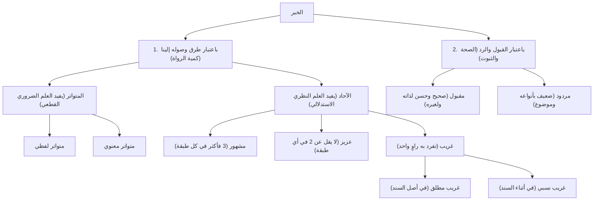

# 📚 مصطلح الحديث — المحاضرة 3: تقسيم الخبر باعتبار طرقه (ملف مجمع)

> [!info] توثيق الملف المجمع
> يشتمل هذا الملف على الجمع الكامل والمنظم لكافة مباحث وأجزاء المحاضرة الثالثة من شرح كتاب [[تيسير مصطلح الحديث]] للدكتور محمود الطحان بشرح الشيخ الشوبكي، مع إثبات **النص الحرفي الكامل لكلام المتحدث** لكل جزء دون اختصار، ومجردًا تمامًا من أسئلة الاختبار الذاتي والمراجعات السريعة، معتمدًا على أرقام أسطر التفريغ الأصلي (1–1201).

---

## 📑 فهرس موضوعات الملف المجمع

1. [[#الجزء الأول: مراجعة المحاضرة السابقة وخريطة تقسيم الخبر (الأسطر 1–200)]]
2. [[#الجزء الثاني: الخبر المتواتر تعريفه وشروطه وأقسامه ومصنفاته (الأسطر 201–564)]]
3. [[#الجزء الثالث: خبر الآحاد والحديث المشهور والمستفيض (الأسطر 565–971)]]
4. [[#الجزء الرابع: الحديث العزيز والغريب بنوعيه المطلق والنسبي (الأسطر 972–1201)]]

---

## الجزء الأول: مراجعة المحاضرة السابقة وخريطة تقسيم الخبر (الأسطر 1–200)

### 1. مراجعة المصطلحات الأساسية
قبل الشروع في الدرس الجديد، استعرض الشيخ المصطلحات العشرة التي سبقت دراستها:

| المصطلح | التعريف |
|---|---|
| **الحديث** | ما أُضيف إلى النبي ﷺ من قول أو فعل أو تقرير أو صفة خَلقية أو خُلقية. |
| **الخبر** | قيل: مرادف للحديث. وقيل: مغاير له (الحديث عن النبي ﷺ، والخبر عن غيره). وقيل: أعم منه. |
| **الأثر** | ما أُضيف إلى الصحابي أو التابعي من قول أو فعل (وقد يُطلق على المرفوع مقيدًا). |
| **الإسناد** | له معنيان: رفع الحديث إلى قائله، أو سلسلة الرجال الموصلة للمتن (بمعنى السند). |
| **السند** | سلسلة الرواة الموصلة إلى المتن؛ وسُمي سندًا لأن الحديث يستند ويعتمد عليه. |
| **المتن** | ما ينتهي إليه السند من الكلام. |
| **المُسْنَد** | له ثلاثة معانٍ: الكتاب الذي جُمعت فيه أحاديث كل صحابي على حدة، أو الحديث المتصل المرفوع، أو اسم مفعول من أسند. |
| **المُسْنِد** | من يروي الحديث بإسناده، سواء كان عنده علم به أو مجرد راوٍ ناقل. |
| **المحدّث** | من يشتغل بعلم الحديث روايةً ودرايةً، ويطّلع على كثير من الرواة والأسانيد. |
| **الحافظ** | أرفع رتبة من المحدث؛ من أحاط بمعظم السنة ورجالها وعللها، وقيل: من حفظ مئة ألف حديث. |
| **الحاكم** | من أحاط بجميع الأحاديث المروية متنًا وإسنادًا وجرحًا وتعديلًا وتاريخًا إلا اليسير النادر. |

---

### 2. الخريطة الشاملة لتقسيم الخبر
قسّم العلماء الخبر باعتبارين رئيسيين منفصلين تمامًا:
1. **باعتبار طرق وصوله إلينا:** (كمية الطرق وعدد الرواة): متواتر، وآحاد (مشهور، عزيز، غريب).
2. **باعتبار القبول والرد:** (صحة الحديث وثبوته): مقبول (صحيح، حسن)، ومردود (ضعيف بأنواعه).

---

### نص المتحدث الكامل (الجزء الأول: الأسطر 1–200)

<b>عرض تفريغ الجزء الأول</b>

بسم الله الرحمن الرحيم الحمد لله والصلاه والسلام على رسول الله وعلى اله وصحبه وسلم تسليما كثيرا اما بعد قال الامام المصنف رحمه الله تعالى ونفعنا بعلومه في الدارين تقسيم الخبر باعتباره وصوله اليه ينقسم الخبر طبعا احنا اخذنا المره اللي فاتت ايه يا اخوه بعض التعريفات تعريف علم مصطلح الحديث الحديث الخبر الاثر الاسناد السند المسند بالفتح المسند بالكسر المحدث الحافظ الحاكم هذه مصطلحات مهمه لابد ان تحفظ كما هي كده غيبا حتى تفهم بقيه هذا العلم ثم شرع بعد ذلك في اول مباحث هذا العلم وهو تقسيم الخبر باعتبار وصوله الينا فالخبر ينقسم باعتبارين ركز معايا في هذا الخبر ينقسم بايه باعتبارين هناك تقسيم باعتبار وصوله الينا يعني عدد الرواه اللي رووه كم واحد رووه وهناك تقسيم اخر باعتبار القبول وايه والرد يعني هل هو صحيح ولا ضعيف يبقى ده تقسيم وده تقسيم تقسيم باعتبار طرقه ورواه وتقسيم باعتبار الصحه وايه والضعف قال المصنف رحمه الله ينقسم الخبر باعتبار وصوله الينا الى قسمين هما خبر متواتر وخبر احاد متواتر وايه واحاد يبقى الخبر باعتبار طرقه اما ان يكون متواتر واما ان يكون احاد والتقسيم ده اصلا ما كانش موجود عند السلف ولكن هذا التقسيم اتى به اهل الاصول دخل في علم الحديث منين من اهل الاصول لكنه تقسيم حسن تقسيم ايه تقسيم حسن فجعلوا هذا التقسيم المتواتر والاحاد وجعلوا المتواتر قسما واحدا وجعلوا الاحاد ثلاثه اقسام مشهور وعزيز وغريب تمام كده يبقى الخبر باعتبار طرقه كم قسم اربعه على هذا التقسيم كم قسم اربعه اربعه متواتر واحاد متواتر ومشهور وعزيز وغريب لان الاحاد بينقسم الى كم قسم ثلاثه ثلاثه مشهور وعزيز وايه وغريب يبقى لو احنا قلنا المتواتر والاحاد المشهور والعزيز والغريب يبقى كام اربعه لو احنا قلنا متواتر واحاد وجعلنا الاحاد ثلاثه اقسام يبقى كم قسم قسمين متواتر واحاد تمام كده فالمتواتر ليس من مباحث علم الحديث اصلا المتواتر ليس من مباحث علم الحديث لماذا لان المتواتر لا يبحث في رواته هو اصلا رووه جمع عن جمع عن جمع تحيل العاده تواطؤهم على الكذب فما دامت العاده تحيل تواطؤهم على الكذب يبقى محتاج ابحث في الروايه هو ثابت اصلا فالمتواتر ثابت ما بيحتاج ان انا ابحث في رواته ده ثقه وده ضعيف ولا ده كذاب ولا ده كذا لا هو روه جمع غفير عن جمع غفير عن جمع غفير خلاص فالمتواتر ليس من مباحث علم الحديث اصلا وانما ذكروه من باب تقسيم ايه تقسيم الكل ذكروه من باب تقسيم الكل يعني بيقسموا الخبر كله فالخبر كله منه متواتر ومنه احاد فذكروا المتواتر عشان التقسيم يكمل مش عشان هو من مباحث علم الحديث معايا مشايخ ثم بعد ذلك شرع في بيان المتواتر فقال المبحث الاول المتواتر لغه اسم فاعل مشتق من التواتر اي التتابع تقول تواتر المطر اي تتابع نزوله واصطلاحا ما رواه عدد كثير تحيل العاده تواطؤهم على الكذب في كل طبقه من طبقات السند وان يكون مستند خبرهم الحس هذا تعريف المتواتر احفظه زي اسمك ما رواه عدد كثير تحيل العاده تواطؤهم على الكذب في كل طبقه من طبقات السند وان يكون مستند خبرهم الحس ركز بقى معايا عشان نفكك هذا التعريف اول شرط ما رواه عدد كثير كم هذا العدد اختلف العلماء فيه بعضهم قال 10 بعضهم قال 20 بعضهم قال 40 بعضهم قال 70 بعضهم قال 300 وبضعه عشر على عدد اهل بدر والصحيح انه لا يشترط عدد معين بل العبره ان يحصل العلم اليقيني بهذا الخبر ان العاده تحيل تواطؤ هؤلاء على الكذب يعني لو احنا جالنا خمسه من بلاد متفرقه هذا من مصر وهذا من الشام وهذا من العراق وهذا من اليمن وهذا من الحجاز وكلهم اخبرونا بخبر واحد وهم لم يلتقوا ولم يجتمعوا ولا يعرف بعضهم بعضا يحصل لنا العلم بان هذا الخبر صدق ولا لا؟ يحصل لان العاده تحيل ان هؤلاء الخمسه اتفقوا على الكذب وهم لم يلتقوا اصلا يبقى العبره ليست بالعدد وانما العبره بماذا؟ بما تحيل العاده تواطؤهم على الكذب الشرط الثاني تحيل العاده تواطؤهم على الكذب يعني العقل والعاده يحيلان ان هؤلاء اتفقوا على اختلاق هذا الخبر لانهم من بلدان شتى ومذاهب شتى واهواء شتى فكيف يتفقون على الكذب؟ الشرط الثالث في كل طبقه من طبقات السند يعني ما ينفعش يجي في طبقه من الطبقات ويكون العدد قليل لازم في كل طبقه من اول السند الى منتهاه يكون هذا العدد الكثير موجود طب لو جه في طبقه من الطبقات ونزل العدد بقى اثنين او ثلاثه يخرج من المتواتر ويدخل في ايه؟ في الاحاد لان العبره باقل طبقه العبره بايه؟ باقل طبقه من طبقات السند الشرط الرابع ان يكون مستند خبرهم الحس يعني ايه مستند خبرهم الحس؟ يعني يقولون سمعنا راينا لمسنا اما لو كان مستند خبرهم العقل فلا يفيد التواتر كان يقول اهل الفلسفه مثلا العالم حادث او الفلاسفه يقولون بقدم العالم هذا مستنده العقل وليس الحس فلا يفيد التواتر يبقى شروط المتواتر كم؟ اربعه عدد كثير تحيل العاده تواطؤهم على الكذب في كل طبقه من طبقات السند وان يكون مستند خبرهم الحس.

---

## الجزء الثاني: الخبر المتواتر تعريفه وشروطه وأقسامه ومصنفاته (الأسطر 201–564)

### 1. شروط المتواتر الأربعة بالتفصيل
1. **العدد الكثير:** لم يحدد الراجح عددًا محصورًا كالعشرة أو الأربعين؛ بل الضابط بلوغ حد الكثرة التي يحصل بها العلم اليقيني.
2. **استحالة التواطؤ على الكذب:** أن تحيل العادة والعقل اتفاقهم العمدي أو العفوي على اختلاق الخبر لاختلاف بلدانهم وأهوائهم ومشاربهم.
3. **وجود الكثرة في كل طبقة:** من ابتداء السند إلى منتهاه (طبقة الصحابة، التابعين، أتباعهم... حتى المصنف). فلو نزلت طبقة واحدة إلى 2 أو 3 نزل الخبر إلى الآحاد.
4. **أن يكون مستند انتهائهم الحس:** أن يقولوا «سمعنا»، «رأينا»، «لمسنا»؛ فإن كان مستندهم الاستدلال العقلي المحض فليس بمتواتر.

---

### 2. حكم المتواتر
- يفيد **العلم الضروري القطعي (اليقيني)** الذي يضطر الإنسان إلى قبوله والتصديق الجازم به دون حاجة لنظر واستدلال، كالعلم بوجود البلدان النائية مثل مكة أو الصين.
- المتواتر **مقبول كله قطعًا**، ولا يُبحث في عدالة رواته ولا أحوالهم؛ لثبوته القطعي.

---

### 3. أقسام المتواتر
ينقسم المتواتر إلى قسمين:
1. **المتواتر اللفظي:** ما تواتر لفظه ومعناه على هيئة واحدة.
   - **مثاله:** حديث: &rlm;«مَن كذب عليَّ متعمّدًا فليتبوّأ مقعده من النار»؛ رواه أكثر من سبعين صحابيًا، منهم العشرة المبشرون بالجنة.
2. **المتواتر المعنوي:** ما تواتر معناه المشترك في وقائع مختلفة دون تواتر لفظه.
   - **مثاله:** أحاديث رفع اليدين في الدعاء؛ رُوي فيها نحو مئة حديث في مواطن متفرقة (الاستسقاء، أحد، بدر، عرفة...) وكل واقعة آحاد، ولكن القدر المشترك (رفع اليدين) متواتر معنويًا.

---

### 4. أحاديث متواترة مشهورة ومصنفاتها
أنشد الشيخ بيتي الحافظ ابن عثيمين رحمه الله:
> مِمَّا تَوَاتَرَ حَدِيثُ: **مَنْ كَذَبْ** ... **وَمَنْ بَنَى لِلهِ بَيْتًا** وَاحْتَسَبْ  
> **وَرُؤْيَةٌ**، **شَفَاعَةٌ**، **وَالحَوْضُ** ... **وَمَسْحُ خُفَّيْنِ**، وَهَذِي بَعْضُ

#### أشهر المصنفات في المتواتر:
- *الأزهار المتناثرة في الأخبار المتواترة* — للحافظ جلال الدين السيوطي (مرتب على الأبواب الفقهية).
- *قطف الأزهار* — للسيوطي (تلخيص للكتاب السابق).
- *نظم المتناثر من الحديث المتواتر* — لمحمد بن جعفر الكتاني.

---

### نص المتحدث الكامل (الجزء الثاني: الأسطر 201–564)

<b>عرض تفريغ الجزء الثاني</b>

تمام كده يا مشايخ؟ نعم. ما يفيده المتواتر: المتواتر يفيد العلم الضروري، يعني ايه العلم الضروري؟ يعني الذي يضطر الانسان الى التصديق به بحيث لا يستطيع ان يدفعه عن نفسه، زي علمك بان مكه موجوده وان بغداد موجوده وان القاهره موجوده، انت رحت الصين؟ لا ما رحتش الصين، لكن تعرف ان في بلد اسمها الصين ولا لا؟ اعرف، طب عرفت منين؟ بالتواتر، كل الناس بتقول في بلد اسمها الصين والاخبار بتيجي من الصين والبضائع بتيجي من الصين، فصار عندك علم يقيني ضروري لا تستطيع ان تدفعه عن نفسك، فالمتواتر يفيد العلم الضروري، والخبر المتواتر كله مقبول لا يحتاج الى بحث في رواته، ولذلك لا يدخل في مباحث علم الحديث التي تبحث في احوال الرواة من حيث القبول والرد. ثم قسم المصنف المتواتر الى قسمين: متواتر لفظي ومتواتر معنوي. الاول: المتواتر اللفظي: وهو ما تواتر لفظه ومعناه، يعني الرواة رووه بنفس اللفظ والمعنى، ومثاله حديث: «من كذب علي متعمدا فليتبوأ مقعده من النار»، هذا الحديث رواه اكثر من سبعين صحابيا، وقيل اكثر من مائه، وفيهم العشرة المبشرون بالجنة، رووه كلهم بهذا اللفظ: «من كذب علي متعمدا فليتبوأ مقعده من النار»، فهذا متواتر لفظي. القسم الثاني: المتواتر المعنوي: وهو ما تواتر معناه دون لفظه، يعني ايه؟ يعني تجيء احاديث كثيره في وقائع مختلفه تشترك كلها في معنى واحد، فالمعنى المشترك ده هو اللي تواتر، وان كانت كل قصه بمفردها لم تتواتر، مثاله احاديث رفع اليدين في الدعاء، فقد ورد عنه صلى الله عليه وسلم نحو مائه حديث في قضايا مختلفه انه رفع يديه في الدعاء: في الاستسقاء رفع يديه، في بدر رفع يديه، على الصفا والمروة رفع يديه، في عرفه رفع يديه، فكل واقعه من هذه الوقائع لم تتواتر، لكن القدر المشترك بينها وهو رفع اليدين في الدعاء تواتر تواترا معنويا، وضحت كده يا جماعه؟ نعم. وكان شيخنا ابن عثيمين رحمه الله ينشد هذه الابيات: مما تواتر حديث من كذب ... ومن بنى لله بيتا واحتسب ... ورؤية شفاعة والحوض ... ومسح خفين وهذي بعض. يعني حديث: «من كذب علي متعمدا»، وحديث: «من بنى لله مسجدا بنى الله له بيتا في الجنه»، وحديث رؤية المؤمنين لربهم يوم القيامه: «انكم سترون ربكم كما ترون القمر ليلة البدر»، واحاديث الشفاعه، واحاديث الحوض: «حوضي مسيرة شهر»، واحاديث المسح على الخفين رواها اكثر من سبعين صحابيا، فهذه كلها احاديث متواتره. هل الاحاديث المتواتره كثيره ام قليله؟ بالنسبه لاحاديث الاحاد هي قليله جدا، الاحاديث المتواتره محصوره وقليله، اما غالب السنه النبويه فهو من قبيل الاحاد. واعتنى العلماء بجمع الاحاديث المتواتره في مصنفات مستقله، من اشهرها: كتاب «الازهار المتناثره في الاخبار المتواتره» للامام السيوطي، وهو مرتب على الابواب الفقهيه، ثم لخصه في كتاب سماه «قطف الازهار»، وكتاب «نظم المتناثر من الحديث المتواتر» للعلامة محمد بن جعفر الكتاني رحمه الله تعالى. نعم يا شيخ، حد عنده سؤال في المتواتر؟ نعم يا شيخ، في حاجه اسمها اجماع يعتبر هو متواتر ولا؟ الاجماع مصطلح خاص بالفقه، خاص بالاحكام الفقهيه، الحكم الذي اجمعت عليه الامه، اما المتواتر فهو مصطلح خاص بالحديث وطرق نقله، فلا خلط بينهما.

---

## الجزء الثالث: خبر الآحاد والحديث المشهور والمستفيض (الأسطر 565–971)

### 1. المبحث الثاني: خبر الآحاد وحكمه
- **لغةً:** الآحاد جمع أحد، وخبر الواحد ما يرويه شخص واحد.
- **اصطلاحًا:** &rlm;ما لم يجمع شروط المتواتر.
- **حكمه:** يفيد **العلم النظري** (المتوقف على النظر والاستدلال والبحث في أحوال الرواة وشروط الصحة).
- **أقسامه باعتبار طرقه:** مشهور، عزيز، غريب.

---

### 2. الحديث المشهور
- **تعريفه:** &rlm;ما رواه ثلاثةٌ فأكثر في كل طبقة من طبقات السند، ما لم يبلغ حدّ التواتر.
- **القاعدة الحاكمة:** &rlm;«الأقل في هذا العلم يقضي على الأكثر».
- **مثاله المشروح:** حديث قبض العلم:
  > &rlm;«إن الله لا يقبضُ العلمَ انتزاعًا ينتزعه من صدور العلماء، ولكن يقبضُ العلمَ بقبضِ العلماء...»
  - طبقة الصحابة (4): عبد الله بن عمرو، أبو هريرة، زياد بن لبيد، عائشة.
  - طبقة التابعين (3): عروة بن الزبير، أبو سلمة بن عبد الرحمن، سالم بن أبي الجعد.
  - طبقة أتباع التابعين (4): هشام بن عروة، موسى بن عقبة، الزهري، الأعمش.
  - الطبقة الرابعة (5): مالك، جرير، العلاء بن سليمان، وكيع بن الجراح، عبد الله بن سعيد.
  - الطبقة الخامسة فما بعدها: رواه أصحاب الكتب المصنفة.

---

### 3. الحديث المستفيض
- **لغةً:** من استفاض الماء إذا كثر وفاض وانتشر.
- **اصطلاحًا:** ثلاثة أقوال:
  1. مرادف للمشهور.
  2. أخصّ من المشهور (يشترط استواء طرفي إسناده أو جميع طبقاته بعدد متساوٍ لا يختلف).
  3. أعمّ من المشهور.

---

### 4. المشهور غير الاصطلاحي (الشهرة على الألسنة)
- ما اشتهر بين الناس دون التزام شروط المحدثين (قد يكون له إسناد صحيح، أو ضعيف، أو لا أصل له).
- **أصنافه:**
  - بين أهل الحديث خاصة: حديث قنوت النبي ﷺ شهرًا يدعو على رعل وذكوان.
  - بين العلماء والعوام: «المسلم من سلم المسلمون من لسانه ويده».
  - بين الفقهاء: «أبغض الحلال إلى الله الطلاق» (مرسل/ضعيف).
  - بين الأصوليين: «رُفع عن أمتي الخطأ والنسيان وما استكرهوا عليه».
  - بين النحاة: «نعم العبد صهيب لو لم يخف الله لم يعصه» (لا أصل له).
  - بين العامة: «العجلة من الشيطان» (حسنه الترمذي).

#### أشهر المصنفات في المشهور على الألسنة:
- *المقاصد الحسنة فيما اشتهر على الألسنة* — للحافظ شمس الدين السخاوي.
- *كشف الخفاء ومزيل الإلباس* — للشيخ إسماعيل العجلوني.
- *تمييز الطيب من الخبيث* — لابن الديبع الشيباني.

---

### نص المتحدث الكامل (الجزء الثالث: الأسطر 565–971)

<b>عرض تفريغ الجزء الثالث</b>

المبحث الثاني خبر الاحاد لغه الاحاد جمع احد بمعنى الواحد وخبر الواحد ما يرويه شخص واحد واصطلاحا هو ما لم يجمع شروطا متواتبه يبقى الاحاد هو الذي لم يبلغ مبلغ ايه التواتر حكمه قلنا الحديث المتواتر يفيد العلم ايه؟ الضروري الضروري ده بقى يفيد العلم النظري ايه العلم النظري العلم المتوقف على النظر والاستدلال لازم استدل وافكر واتامل حتى يحصل لي العلم بهذا الحديث لان انا محتاج ان انا اشوف هو صح ولا غلط صحيح ولا ضعيف فابحث في سنده وانظر في رجال ورواته وبعد ذلك اشوفه استوفى الصحه ولا لا واحكم عليه بعد ذلك وكل تقسيم باعتبار وساذكر هذين التقسيمه هيبدا بقى معايا تقسيم خبر الاحاد بالنسبه الى عدد طرقه كم قسم مشهور مشهور عزيز وعزيز وغريب الاول المشهور وهو لغه اسم مفعول من شهر الامر اذا اعلنته واظهرته وسمي بذلك لظهوره يبقى كلمه مشهور معناها ان هو ايه انتصر انتشر واشتهر وعرف بين الناس واصطلاحا ما رواه ثلاثه فاكثر في كل طبقه ما لم يبلغ حد التواتر يبقى قلنا يا اخو في كل طبقه من طبقاته ثلاثه في ايهكثر لو جاف طبقه وقل عن ثلاثه ما يبقاش مشهور يبقى عزين على حسب ما هو كان بالظبط فقلنا ان اقل حاجه هي الحاكمه في هذا البان فلا بد ان يكون في كل طبقه ثلاثه فايه فاكثر طيب مثاله حديث ان الله لا يقبض العلم انتزاعا ينتزعه من صدور العلماء ولكن يقبض العلم بقبض العلماء حتى اذا لم يبق عالما اتخذ الناس رؤوسا جهالا فسئلوا فافتوا بغير علم فضلوا نعوذ بالله من ذلك تعال بقى نشوف الشيخ لما عمل لنا مخطط جميل لايه لحديث ا ان الله ليقبض العلم مشهور يا شيخ مستفيض على راي وهو المستفيض على راي وبعضهم يقول لا المستفيض حاجه ثانيه المستفيض ما ما تساوى طرف اسناده او زيها مستفيض ما يكون كله حاجه واحده اوله زي اخره هنا لاثه هنا لاثه هنا لاثه هنا لاه لكن المشهور ممكن يكون لاثه هنا اربعه خمسه بيبقى بيلعب في اكتر من لاثه لكن المستفيض لازم يبقى كله حاجه واحده استوى طرف بس برض في في حدود الثلاثه او الاربعه الحديث اللي معانا ان الله لا يقبض العلم انتزاعا جاء عن النبي صلى الله عليه وسلم رواه من اصحاب النبي صلى الله عليه وسلم اربعه اشهرهم عبد الله بن عمرو بن العاص رضي الله عنه وابو هريره رواه كذلك وزياد بن لبيد صحابي ايضا و عائشه رضي الله عنها وار يبقى كده في اول طبقه تحقق ان هو اربعه واحنا قلنا المشهور ثلاثه فاكثر طيب نيجي الطبقه اللي بعدها رواه عن عبد الله عروه ابن الزبير ورواه عن ابي هريره ابو سلمه ورواه عن زياد سالم ابن ابي الجعد وايضا رواه عن عائشه عروه وطبعا عروه معانا فهيبقى كده مكرر يبقى كده رواه كام واحد هنا في الطبقه دي ثلاثه قل عن ثلاثه؟ لا مشهور. لو اثنين رووا عن واحد يبقى اثنين، العبره بالاشخاص. ثم رواه عن عروه هشام ابنه هشام بن عروه، ورواه عن ابو سلمه الزهري محمد بن مسلم، ورواه عن سالم الاعمش، ورواه عن عروه موسى بن عقبه، كام؟ اربعه. ثم اخذ عن هشام مالك واخذ عن الزهري العلاء واخذ عن هشام جرير واخذ عن الاعمش وكيع واخذ عن موسى بن عقبه عبد الله بن سعيد، كام؟ خمسه. ثم اخذ عن هؤلاء البخاري ومسلم والطبراني والخطيب. في كتب اسمها كتب تتعلق بتراجم الرجال زي سير اعلام النبلاء وتاريخ بغداد تحدد طبقات الرواة، وابن حجر قسم الطبقات ل 12 طبقه في كتابه تقريب التهذيب وهو كتاب لا يستغني عنه طالب علم الحديث. المستفيض لغه مشتق من فاض الماء، واصطلاحا اختلف فيه على ثلاثه اقوال: انه مرادف للمشهور، او اخص منه لانه يشترط ان يستوي طرفا اسناده، وقيل هو اعم منه. في بقى مشهور غير اصطلاحي وهو ما اشتهر على الالسنه من غير شروط تعتبر، وله انواع: مشهور بين اهل الحديث كحديث قنوت النبي شهرا يدعو على رعل وذكوان، مشهور بين اهل الحديث والعوام كحديث المسلم من سلم المسلمون من لسانه ويده، مشهور بين الفقهاء كحديث ابغض الحلال الى الله الطلاق وهو مرسل ضعيف، مشهور بين الاصوليين كحديث رفع عن امتي الخطا والنسيان، مشهور بين النحاه كحديث نعم العبد صهيب لا اصل له، مشهور بين العامه كحديث العجله من الشيطان حسنه الترمذي. والمشهور لا يوصف بصحه ولا ضعف لمجرد شهرته بل يبحث في سنده. واشهر المصنفات في المشهور على الالسنه: المقاصد الحسنه للسخاوي، وكشف الخفاء للعجلوني، وتمييز الطيب من الخبيث لابن الديبع الشيباني.

---

## الجزء الرابع: الحديث العزيز والغريب بنوعيه المطلق والنسبي (الأسطر 972–1201)

### 1. الحديث العزيز
- **لغةً:** صفة مشبهة من عَزَّ يَعِزُّ (قَلَّ ونَدَرَ)، أو من عَزَّ يَعَزُّ (قَوِيَ واشتدّ).
- **اصطلاحًا:** &rlm;ألا يقلّ رواته عن اثنين في جميع طبقات السند.
- **مثاله المشهور:** حديث محبة النبي ﷺ:
  > &rlm;«لا يؤمنُ أحدُكم حتى أكونَ أحبَّ إليه من والدِه وولدِه والناسِ أجمعين»
  - طبقة الصحابة (2): أنس بن مالك، وأبو هريرة.
  - طبقة التابعين عن أنس (2): قتادة بن دعامة السدوسي، وعبد العزيز بن صهيب.
  - طبقة أتباع التابعين (4): شعبة بن الحجاج، وسعيد بن أبي عروبة (عن قتادة)، وإسماعيل بن علية، وعبد الوارث بن سعيد (عن عبد العزيز).
  - ثم زاد العدد بعد ذلك؛ فالعبرة بالطبقة الأقل.

---

### 2. الحديث الغريب (الفرد)
- **لغةً:** صفة مشبهة بمعنى المنفرد أو البعيد عن وطنه.
- **اصطلاحًا:** &rlm;ما ينفرد بروايته راوٍ واحد في أي طبقة من طبقات السند.
- **العلاقة بين الفرد والغريب:** هما مترادفان لغة واصطلاحًا عند الحافظ ابن حجر؛ إلا أن الفرد يغلب استعماله في «الفرد المطلق»، والغريب في «الفرد النسبي».

---

### 3. أقسام الغريب باعتبار موضع التفرد
1. **الغريب المطلق (الفرد المطلق):** ما كانت الغرابة في أصل سنده (الصحابي).
   - **مثاله:** حديث: «إنما الأعمال بالنيات» تفرد به عمر بن الخطاب رضي الله عنه.
2. **الغريب النسبي (الفرد النسبي):** ما كانت الغرابة في أثناء سنده (بعد الصحابي).
   - **مثاله:** حديث دخول النبي ﷺ مكة وعلى رأسه المغفر؛ تفرد به مالك عن الزهري عن أنس.

---

### 4. صور الغرابة النسبية ومظان الغريب ومصنفاته
- **صور الغرابة النسبية:** تفرد ثقة، تفرد راوٍ عن راوٍ، تفرد أهل بلد (كأهل الشام أو مكة)، تفرد أهل بلد عن أهل بلد آخر (كأهل البصرة عن أهل المدينة).
- **تقسيم الغريب باعتبار المتن والإسناد:**
  - غريب متنًا وإسنادًا: تفرد براوي متنه راوٍ واحد كحديث الأعمال بالنيات.
  - غريب إسنادًا لا متنًا: متنه محفوظ من طرق أخرى وتفرد راوٍ بهذا الوجه المخصوص (وهو مراد الترمذي بقوله: «غريب من هذا الوجه»).
- **مظان الغريب:** مسند البزار (*البحر الزخار*)، المعجم الأوسط والمعجم الصغير للطبراني.
- **المصنفات في الغريب:**
  - *غرائب مالك* للدارقطني.
  - *الأفراد* للدارقطني.
  - *السنن التي تفرد بكل سنة منها أهل بلدة* لأبي داود السجستاني.

---

### نص المتحدث الكامل (الجزء الرابع: الأسطر 972–1201)

<b>عرض تفريغ الجزء الرابع</b>

ثم ناتي الى العزيز لغه هو صفه مشبهه من عز يعز اي قل وندر وقيل من عز يعز اي قوي واشتد وسمي بذلك اما لقله وجوده وندرته واما لقوته بمجيئه من طريق اخر واصطلاحا الا يقل رواته عن اثنين في جميع طبقات السند يبقى المفروض يا اخوه ان هو لا يقل عن اثنين. قلنا ان هو الاقل في هذا العلم يقضي على الاكثر، يعني لا يوجد في طبقه من طبقات السند اقل من اثنين، اما ان وجد في بعض طبقات السند ثلاثه فاكثر فلا يضر بشرط ان تبقى ولو طبقه واحده فيها اثنان لان العبره لاقل طبقه من طبقات السند. هذا التعريف هو الراجح كما حرره الحافظ ابن حجر. مثاله ما رواه الشيخان من حديث انس والبخاري من حديث ابي هريره ان النبي صلى الله عليه وسلم قال: «لا يؤمن احدكم حتى اكون احب اليه من والده وولده والناس اجمعين». رواه اثنان من الصحابه: سيدنا انس وابو هريره، ورواه عن انس رجلان: قتاده بن دعامه السدوسي وعبد العزيز بن صهيب، ورواه عن قتاده شعبه وسعيد، وعن عبد العزيز اسماعيل بن عليه وعبد الوارث، فهؤلاء اربعه في هذه الطبقه، فهذا عزيز لانه لم يقل عن اثنين في طبقتي الصحابه والتابعين. ثم الغريب: لغه صفه مشبهه بمعنى المنفرد او البعيد عن اقاربه، واصطلاحا ما ينفرد بروايته راو واحد في كل طبقه او في بعض طبقات السند، ولا تضر الزياده على واحد في باقي الطبقات لان العبره باقل طبقه. ويطلق كثير من العلماء على الغريب اسم اخر وهو الفرد، وهما مترادفان عند الحافظ ابن حجر، الا ان الفرد اكثر ما يطلقونه على الفرد المطلق، والغريب اكثر ما يطلقونه على الفرد النسبي. اقسامه: غريب مطلق وغريب نسبي. الغريب المطلق: ما كانت الغرابه في اصل سنده اي ما ينفرد بروايته شخص واحد في اصل سنده (الصحابي)، مثاله حديث «انما الاعمال بالنيات» تفرد به عمر بن الخطاب رضي الله عنه. والغريب النسبي: ما كانت الغرابه في اثناء سنده، اي ان يرويه اكثر من راو في اصل سنده ثم ينفرد بروايته راو واحد عن اولئك الرواه، مثاله حديث مالك عن الزهري عن انس ان النبي صلى الله عليه وسلم دخل مكه وعلى راسه المغفر، تفرد به مالك عن الزهري. وسمي نسبيا لان التفرد وقع بالنسبه الى شخص معين. ومن انواع الغريب النسبي: تفرد ثقه، تفرد راو معين عن راو معين، تفرد اهل بلد كقولهم تفرد به اهل مكه او اهل الشام، تفرد اهل بلد عن اهل بلد كتفرد اهل البصره عن اهل المدينه. وقسم العلماء الغريب الى: غريب متنا وسندا، وغريب اسنادا لا متنا كحديث روى متنه جماعه وانفرد واحد بروايته عن صحابي اخر، وهو مراد الترمذي بقوله: «غريب من هذا الوجه». ومن مظان الغريب: مسند البزار (البحر الزخار)، والمعجم الاوسط والمعجم الصغير للطبراني. واشهر المصنفات فيه: غرائب مالك للدارقطني، والافراد للدارقطني، والسنن التي تفرد بكل سنه منها اهل بلد لابي داود السجستاني. والى هنا ينتهي الدرس وناخذ ان شاء الله المقبول والمردود في الدرس القادم.

---

## 📌 خاتمة ومراجع المحاضرة

- **الكتاب المعتمد:** [[تيسير مصطلح الحديث]] — د. محمود الطحان.
- **الشرح الصوتي:** فضيلة الشيخ الشوبكي حفظه الله.
- **الملفات ذات الصلة:**
  - [[00 - الفهرس والخطة]]
  - [[01 - مراجعة المحاضرة السابقة وخريطة تقسيم الخبر]]
  - [[02 - الخبر المتواتر تعريفه وشروطه وأقسامه ومصنفاته]]
  - [[03 - خبر الآحاد والحديث المشهور والمستفيض]]
  - [[04 - الحديث العزيز والغريب بنوعيه المطلق والنسبي]]
  - [[ملخص المراجعة السريعة]]
  - [[أسئلة المراجعة والاختبار الذاتي]]
  - [[05 - خطة تطبيق الدروس]]
