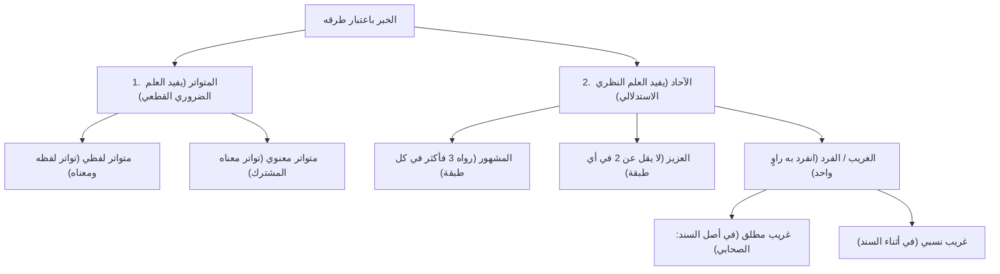

# ⚡ ملخص المراجعة السريعة — المحاضرة الثالثة

> **المادة:** [[تيسير مصطلح الحديث]] | شرح الشيخ الشوبكي  
> **موضوع المحاضرة:** تقسيم [[الخبر]] باعتبار طرقه ([[المتواتر]] و[[الآحاد]]: المشهور، العزيز، الغريب)

---

## 🧭 الخريطة الشاملة لتقسيم الخبر

---

## 📊 جدول المقارنة الفارق بين أقسام الخبر

| القسم | ضابطه العددي | ما يفيده من العلم | مثاله الأبرز | أشهر مصنفاته |
|-------|--------------|-------------------|--------------|--------------|
| **[[المتواتر]] اللفظي** | جمع كثير تُحيل العادة تواطؤهم على الكذب في كل طبقة | العلم الضروري القطعي | «من كذب عليَّ متعمّدًا فليتبوأ مقعده من النار» (رواه أكثر من 70 صحابيًا) | *الأزهار المتناثرة* للسيوطي، و*نظم المتناثر* للكتاني |
| **[[المتواتر]] المعنوي** | تواتر المعنى المشترك دون اتحاد الألفاظ | العلم الضروري القطعي | أحاديث رفع اليدين في الدعاء (نحو 100 حديث في وقائع شتى) | مضمّن في كتب المتواتر |
| **[[المشهور]] الاصطلاحي** | 3 فأكثر في كل طبقة (دون حد التواتر) | العلم النظري (منه صحيح وضعيف) | «إن الله لا يقبض العلم انتزاعًا...» | لم تفرد كتب له، وإنما صنفوا في المشهور على الألسنة |
| **[[المستفيض]]** | قيل: مرادف للمشهور، وقيل: أخص (استوى طرفاه أو كل طبقاته) | العلم النظري | يندرج تحت المشهور | يتبع كتب المشهور |
| **المشهور على الألسنة (غير اصطلاحي)** | ما شاع بين الناس (له إسناد واحد، أو متعدد، أو لا أصل له) | بحسب إسناده (لا يوصف بصحة لذاته) | «المسلم من سلم المسلمون»، «أبغض الحلال»، «العجلة من الشيطان» | *المقاصد الحسنة* للسخاوي، و*كشف الخفاء* للعجلوني |
| **[[العزيز]]** | ألا يقل عن 2 في أي طبقة من طبقات السند | العلم النظري | «لا يؤمن أحدكم حتى أكون أحب إليه من والده وولده والناس أجمعين» | ليس له مصنف مستقل مفرد |
| **[[الغريب]] المطلق (الفرد المطلق)** | انفرد به راوٍ واحد في أصل السند (الصحابي) | العلم النظري | «إنما الأعمال بالنيات» (تفرد به عمر رضي الله عنه) | *مسند البزار*، *المعجم الأوسط*، *غرائب مالك* للدارقطني |
| **[[الغريب]] النسبي (الفرد النسبي)** | انفرد به راوٍ في أثناء السند (بعد الصحابي) | العلم النظري | حديث دخول مكة بالمِغْفَر (تفرد به مالك عن الزهري) | *الأفراد* للدارقطني، و*السنن التي تفرد بكل سنة منها أهل بلدة* لأبي داود |

---

## 💎 القواعد الذهبية الأربع للدرس

1. **قاعدة العبرة بالأقل:**  
   &rlm;«الأقل في هذا العلم يقضي على الأكثر».  
   إذا كان في سند حديث: 5 رواة في طبقة الصحابة، و2 في طبقة التابعين، و10 في طبقة أتباع التابعين ← يحكم للحديث بأنه **عزيز** لوجود طبقة فيها اثنان، ولا ينظر للكثرة في باقي الطبقات.
2. **قاعدة التفريق بين الطرق والقبول:**  
   تقسيم الحديث إلى (متواتر، مشهور، عزيز، غريب) هو تقسيم باعتبار **عدد الطرق**، ولا تلازم قط بين الغرابة والضعف، ولا بين الشهرة والصحة؛ فالآحاد بجميع أصنافه منه الصحيح والحسن والضعيف والموضوع.
3. **قاعدة العبرة بالأشخاص لا بالطرق المكررة:**  
   في عدّ الرواة في الطبقة، العبرة بعدد **أعيان الرواة**؛ فلو روى شخص واحد الحديث عن ثلاثة شيوخ، عُدّ شخصًا واحدًا في طبقته.
4. **أبيات الشيخ ابن عثيمين لأشهر المتواترات:**
   > مِمَّا تَوَاتَرَ حَدِيثُ: **مَنْ كَذَبْ** ... **وَمَنْ بَنَى لِلهِ بَيْتًا** وَاحْتَسَبْ  
   > **وَرُؤْيَةٌ**، **شَفَاعَةٌ**، **وَالحَوْضُ** ... **وَمَسْحُ خُفَّيْنِ**، وَهَذِي بَعْضُ

---

← [[00 - الفهرس والخطة|العودة إلى الفهرس]] | [[أسئلة المراجعة والاختبار الذاتي|الانتقال إلى الاختبار الذاتي]] →
